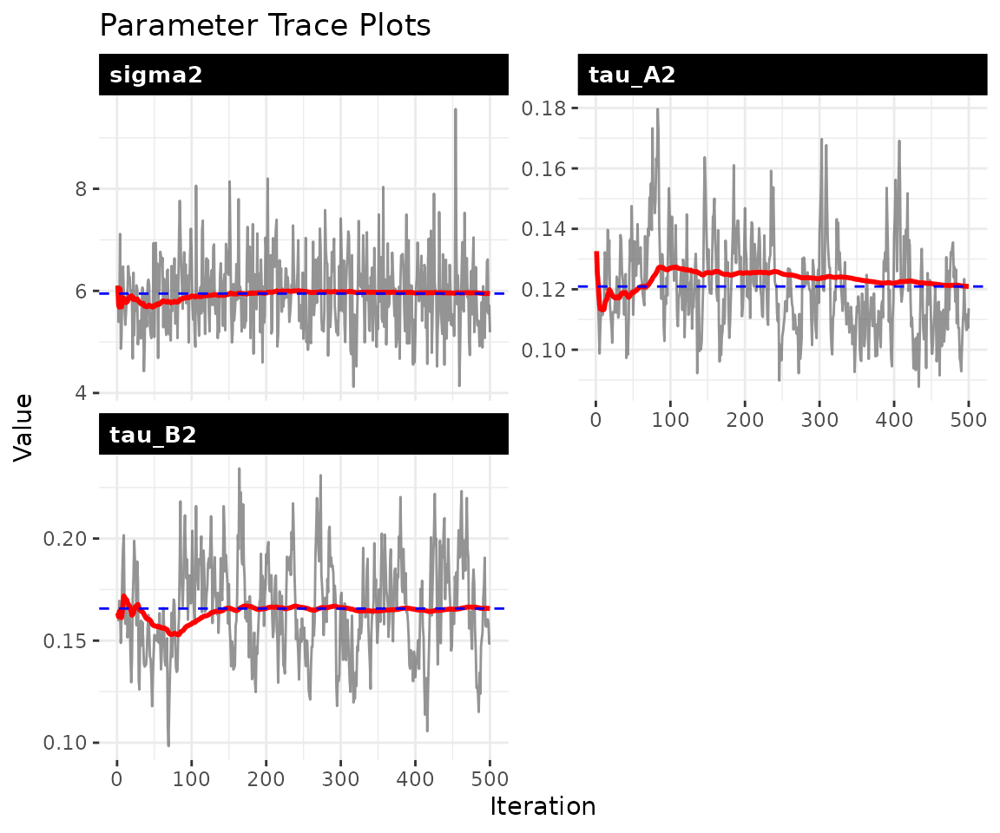
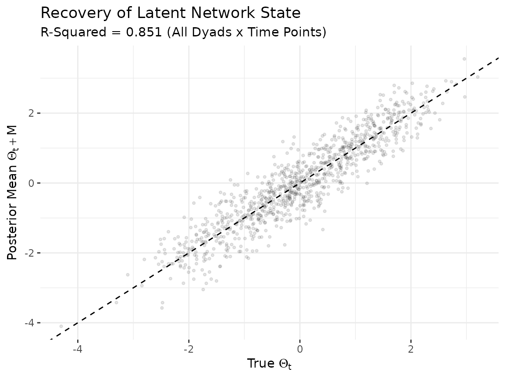

# Dynamic bilinear network models

## 1 The model

The dynamic bilinear model allows the influence matrices $A_{t}$ and
$B_{t}$ to change over time, capturing settings where the rules
governing network evolution are themselves evolving:

$$\Theta_{t} = A_{t}\,\Theta_{t - 1}\, B_{t}^{\top} + M + \varepsilon_{t}$$

Entry $a_{i,i\prime,t}$ of the sender influence matrix $A_{t}$ measures
how strongly actor $i\prime$’s past sending behavior predicts actor
$i$’s current sending at time $t$. The receiver matrix $B_{t}$ captures
the analogous pattern on the targeting side. The baseline mean $M$
absorbs stable dyad-specific tendencies that persist regardless of the
dynamics.

Two additional parameters govern how rapidly the influence structure
reorganizes. The innovation variances $\tau_{A}^{2}$ and $\tau_{B}^{2}$
control step-to-step variation in $A_{t}$ and $B_{t}$: values near zero
indicate a nearly static structure, while larger values allow rapid
reorganization. When `ar1 = TRUE`, the model adds persistence parameters
$\rho_{A}$ and $\rho_{B}$ that measure mean reversion. Values of $\rho$
near 1 indicate that the influence structure is highly persistent;
values near 0 indicate rapid reversion to the prior mean.

## 2 Simulate data

We generate a Gaussian network with time-varying influence matrices.
Setting `ar1 = TRUE` gives the influence matrices AR(1) dynamics, so
each period’s influence structure is a noisy version of the previous
period’s rather than an uncorrelated random walk. The high persistence
($\rho = 0.9$) and small innovation variance ($\tau^{2} = 0.04$) create
smoothly evolving dynamics that are easier to recover from limited data.

``` r
sim = simulate_dynamic_dbn(
  n      = 8,
  p      = 1,
  time   = 15,
  sigma2 = 0.3,
  tauA2  = 0.04,
  tauB2  = 0.04,
  ar1    = TRUE,
  rhoA   = 0.9,
  rhoB   = 0.9,
  seed   = 6886
)

Y = sim$Z
dim(Y)
#> [1]  8  8  1 15
```

## 3 Fit the model

We set `ar1 = TRUE` so the model uses AR(1) dynamics for $A_{t}$ and
$B_{t}$, and `update_rho = TRUE` so the persistence parameters are
estimated from the data rather than fixed at a default value.

``` r
fit = dbn(
  Y,
  family     = "gaussian",
  model      = "dynamic",
  nscan      = 1000,
  burn       = 500,
  odens      = 2,
  ar1        = TRUE,
  update_rho = TRUE,
  verbose    = FALSE
)
```

## 4 Convergence diagnostics

The trace plots should show stationary chains with no drift. For the
dynamic model, the key parameters are $\sigma^{2}$ (process noise),
$\tau_{A}^{2}$ and $\tau_{B}^{2}$ (innovation variances), and $\rho_{A}$
and $\rho_{B}$ (persistence).

``` r
check_convergence(fit)
#>    sigma2    tau_A2    tau_B2        g2 
#> 498.11527  77.69979  65.80980 392.33129
#> 
#> Fraction in 1st window = 0.1
#> Fraction in 2nd window = 0.5 
#> 
#>  sigma2  tau_A2  tau_B2      g2 
#> -2.1739  0.5757 -1.2306 -0.6350
```


``` r
plot_trace(fit, pars = c("sigma2", "tau_A2", "tau_B2", "rho_A", "rho_B"))
```



## 5 Parameter recovery

### Scalar parameters

``` r
param_summary(fit)
#>    parameter       mean         sd       q2.5       q50     q97.5
#> 1     sigma2 5.94737738 0.72658796 4.70775216 5.9317598 7.4606929
#> 2     tau_A2 0.12091809 0.01561779 0.09610393 0.1194444 0.1556927
#> 3     tau_B2 0.16572224 0.02368038 0.12372206 0.1642472 0.2142344
#> 4         g2 0.09200445 0.02070456 0.05860016 0.0891350 0.1392518
#> 5       rhoA 0.78392539 0.03691866 0.70602944 0.7861769 0.8479822
#> 6       rhoB 0.74915741 0.04180474 0.66540326 0.7519273 0.8301224
#> 7 sigma2_obs 0.91885799 0.05993262 0.80695241 0.9171687 1.0322075
```

The model estimates variance parameters that govern the dynamics. The
internal parameterization may differ in scale from the simulation
inputs, so direct comparison of scalar values is not always meaningful.
The most informative validation is whether the model recovers the latent
network trajectories.

### Latent network recovery

The model’s primary output is the latent network state $\Theta_{t}$. We
compare the posterior mean of $\Theta_{t} + M$ to the true values across
all dyads and time points. Strong correlation along the diagonal
indicates that the model is capturing both the cross-sectional structure
and the temporal dynamics.

``` r
Theta_mean = apply(fit$Theta, 1:4, mean)
M_mean = apply(fit$M, 1:3, mean)

n_act = dim(sim$Theta)[1]
Tt = dim(sim$Theta)[4]

true_vals = numeric(0)
est_vals  = numeric(0)

for (t in seq_len(Tt)) {
  true_mat = sim$Theta[, , 1, t]
  est_mat  = Theta_mean[, , 1, t] + M_mean[, , 1]
  mask = !is.na(true_mat)
  true_vals = c(true_vals, true_mat[mask])
  est_vals  = c(est_vals, est_mat[mask])
}

df_theta = data.frame(truth = true_vals, estimate = est_vals)
r_sq = round(cor(df_theta$truth, df_theta$estimate)^2, 3)

ggplot(df_theta, aes(x = truth, y = estimate)) +
  geom_abline(slope = 1, intercept = 0, linetype = "dashed") +
  geom_point(alpha = 0.1, size = 0.8) +
  labs(
    title    = "Recovery of Latent Network State",
    subtitle = paste0("R-Squared = ", r_sq, " (All Dyads x Time Points)"),
    x = expression("True " * Theta[t]),
    y = expression("Posterior Mean " * Theta[t] + M)
  ) +
  theme_bw() +
  theme(panel.border = element_blank())
```



Each point represents one off-diagonal dyad at one time point. Some
scatter is expected due to posterior shrinkage and estimation
uncertainty, but the bulk of points should cluster along the diagonal.

## 6 Dyad trajectories

The
[`dyad_path()`](https://netify-dev.github.io/dbn/reference/dyad_path.md)
function tracks how a specific bilateral relationship evolves over time,
with a ribbon showing the posterior credible interval. Wider ribbons
indicate greater uncertainty about the trajectory of that particular
relationship.

``` r
dyad_path(fit, i = 1, j = 2)
```


## 7 Forecasting

We generate forecasts 5 steps ahead by propagating the estimated
dynamics forward. Each of the 200 posterior draws produces a different
forecast trajectory (reflecting uncertainty in $A$, $B$, and
$\sigma^{2}$), and `summary = "mean"` averages across them.

``` r
fc = predict(fit, H = 5, S = 200, summary = "mean")
dim(fc)
#> [1] 8 8 1 5
```

The resulting array has dimensions
`[actors, actors, relations, horizon]`. These forecasts assume the
final-period dynamics continue unchanged, so they are most informative
over short horizons.

## 8 Network statistics over time

The
[`network_summary()`](https://netify-dev.github.io/dbn/reference/network_summary.md)
function tracks a network-level statistic across time with posterior
credible intervals, providing a macro-level view of how the network
evolves.

``` r
ns = network_summary(fit, stat = "density")
head(ns)
#>   time      mean     lower     upper
#> 1    1 0.4633571 0.3750000 0.5535714
#> 2    2 0.4594286 0.3928571 0.5357143
#> 3    3 0.4991071 0.4285714 0.5714286
#> 4    4 0.4861786 0.4107143 0.5714286
#> 5    5 0.4926786 0.4107143 0.5714286
#> 6    6 0.4603929 0.3750000 0.5357143
```

The
[`edge_prob()`](https://netify-dev.github.io/dbn/reference/edge_prob.md)
function computes the posterior probability that each edge is positive
at a given time point. Values near 1 indicate reliably positive edges;
values near 0.5 indicate substantial uncertainty about the sign.

``` r
ep = edge_prob(fit, rel = 1, time = dim(Y)[4])
round(ep[1:5, 1:5], 2)
#>      [,1] [,2] [,3] [,4] [,5]
#> [1,]   NA 0.99 0.83 0.75 0.72
#> [2,] 0.53   NA 0.38 0.23 0.80
#> [3,] 0.36 0.25   NA 0.14 0.06
#> [4,] 0.04 0.40 0.27   NA 0.92
#> [5,] 0.51 0.86 0.96 0.22   NA
```

## 9 Bipartite networks

The package automatically detects bipartite networks when the sender and
receiver dimensions differ. Passing a rectangular array causes the model
to estimate $A$ as `n_row x n_row` (sender dynamics) and $B$ as
`n_col x n_col` (receiver dynamics).

``` r
sim_bp = simulate_dynamic_dbn(
  n = 8, n_col = 6, p = 1, time = 12, seed = 6886
)

fit_bp = dbn(
  sim_bp$Z,
  model   = "dynamic",
  family  = "gaussian",
  nscan   = 1000,
  burn    = 500,
  odens   = 2,
  verbose = FALSE
)
summary(fit_bp)
```

## 10 Parallel computation

The dynamic model parallelizes row-wise FFBS updates via OpenMP. For
networks with 15 or more actors, multi-threading produces meaningful
speedups (typically 2-4x with 4-8 cores).

``` r
set_dbn_threads(parallel::detectCores(logical = FALSE))
```

## 11 Scaling guidance

For larger networks, the main constraint is RAM. Use
[`estimate_memory()`](https://netify-dev.github.io/dbn/reference/estimate_memory.md)
before fitting, and adjust `time_thin` and `odens` to manage memory.

``` r
estimate_memory(
  n_row = 50, n_col = 50, p = 1, Tt = 30,
  nscan = 1000, burn = 500, odens = 2,
  time_thin = 2, family = "gaussian"
)
#> Dynamic DBN memory estimate:
#>   Network:   50 x 50, 1 relation(s), 30 time points
#>   MCMC:      500 draws (nscan=1000, odens=2)
#>   Time thin: 2 (keeping 15 of 30 time points)
#>   --------------------------------
#>   Theta:    0.14 GB
#>   A:        0.14 GB
#>   B:        0.14 GB
#>   M:        0.01 GB
#>   --------------------------------
#>   TOTAL:    0.43 GB
```

For 100+ actors, expect to need 16-32 GB depending on settings.
Increasing `time_thin` and `odens` are the most effective ways to reduce
memory usage.

## 12 Next steps

For impulse response analysis that traces how shocks propagate through
the estimated dynamics, see
[`vignette("impulse_response")`](https://netify-dev.github.io/dbn/articles/impulse_response.md).
For models with known structural breaks where the influence structure
shifts at discrete time points, see
[`vignette("piecewise_dbn")`](https://netify-dev.github.io/dbn/articles/piecewise_dbn.md).
For large networks (50+ actors), see
[`vignette("lowrank_dbn")`](https://netify-dev.github.io/dbn/articles/lowrank_dbn.md).
