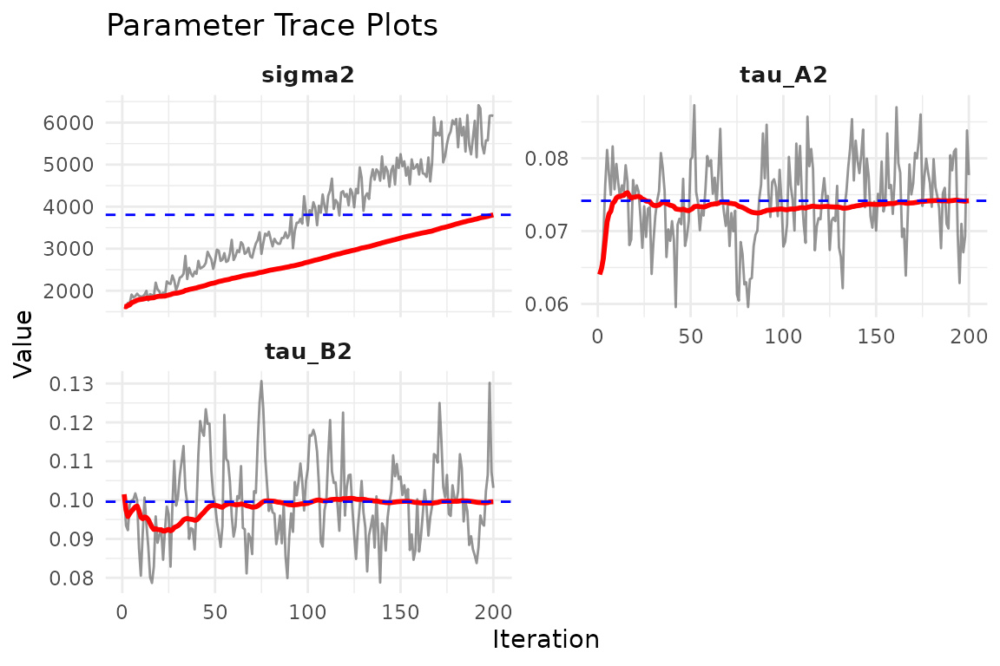
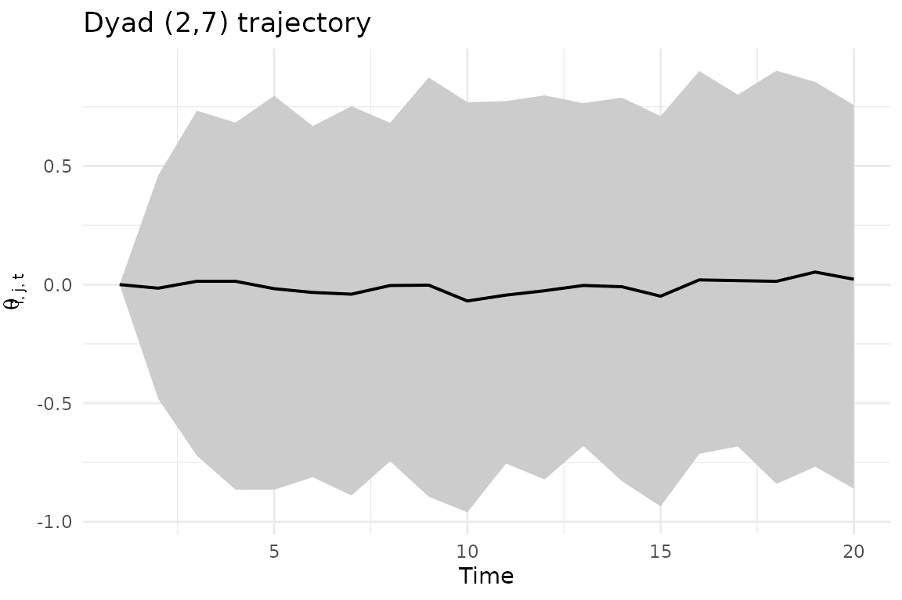
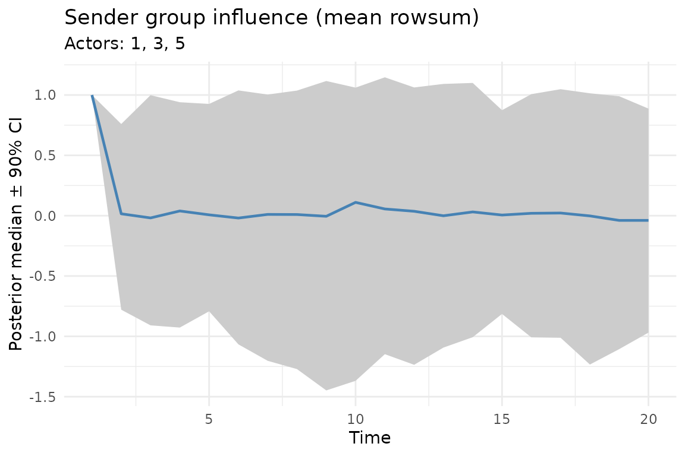

# Dynamic bilinear network models

## 1 The model

The dynamic bilinear model estimates how past network interactions
predict future interactions, and how that predictive mapping itself
changes over time. The core equation is:

$$\Theta_{t} = A_{t}\,\Theta_{t - 1}\, B_{t}^{\top} + M + \varepsilon_{t}$$

where $\Theta_{t}$ is the latent interaction state at time $t$ (an
$n \times n$ matrix), $A_{t}$ and $B_{t}$ are the time-varying sender
and receiver influence matrices, and $M$ is a baseline mean capturing
persistent dyad-specific tendencies.

**What each parameter tells you:**

- **$A_{t}$ (sender influence):** An $n \times n$ matrix where entry
  $a_{i,i\prime,t}$ measures how strongly actor $i\prime$’s past
  behavior as a sender predicts actor $i$’s current sending behavior.
  Large positive values indicate that $i$ follows or echoes $i\prime$;
  negative values indicate opposing patterns.
- **$B_{t}$ (receiver influence):** Entry $b_{j,j\prime,t}$ captures how
  past targeting of actor $j\prime$ predicts current targeting of $j$.
  This reveals shifting alliances and targeting patterns.
- **$M$ (baseline mean):** Captures stable, time-invariant dyad-specific
  tendencies. A large $M_{ij}$ indicates a persistent tendency for actor
  $i$ to interact with actor $j$, regardless of dynamics.
- **$\sigma^{2}$ (process variance):** How much unexplained variation
  remains in the latent network after accounting for the bilinear
  dynamics.
- **$\tau_{A}^{2}$, $\tau_{B}^{2}$ (innovation variances):** How rapidly
  the influence matrices change from one period to the next. Large
  values mean the influence structure is reorganizing quickly; small
  values mean it is relatively stable. If $\tau_{A}^{2}$ is near zero,
  the data favor a static influence structure.
- **$\rho_{A}$, $\rho_{B}$ (AR(1) coefficients, optional):** How
  persistent the influence matrices are. Values near 1 indicate strong
  persistence; values near 0 indicate rapid mean reversion.

See the [methodology
page](https://netify-dev.github.io/dbn/articles/methodology.md) and the
[working
paper](https://netify-dev.github.io/dbn/salau_minhas_when_shocks_cascade.pdf)
for the full mathematical treatment.

## 2 Simulate a dynamic data set

``` r
set.seed(6886)
sim <- simulate_dynamic_dbn(n = 12,   # network size: 12 actors
                           p   =  1,
                           time  = 20)   # total time periods: 20
Y <- sim$Y
dim(Y)
#> [1] 12 12  1 20
```

## 3 Fit the dynamic model

``` r
fit_dyn <- dbn(Y,
               family = "ordinal",  # ordinal data via rank likelihood
               model = 'dynamic',   # time-varying A_t, B_t
               nscan = 800,
               burn = 400,
               odens = 4,           # save every 4th iteration
               time_thin = 1,       # save every time period
               ar1 = TRUE,          # enable autoregressive dynamics
               update_rho = TRUE,
               verbose = TRUE)
```

## 4 Convergence diagnostics

Always check convergence before interpreting results. The trace plots
show the MCMC chains for each scalar parameter:

- **sigma2**: process variance — should stabilize, indicating the
  sampler has found the right noise level
- **tau_A2 / tau_B2**: innovation variances — these tell you how much
  the influence matrices change between periods
- **rho_A / rho_B**: AR(1) persistence — values near 1 indicate strong
  temporal persistence in the influence structure

``` r
check_convergence(fit_dyn)
#>    sigma2    tau_A2    tau_B2        g2 
#>  2.066464 61.515167 36.456775 51.913459
#> 
#> Fraction in 1st window = 0.1
#> Fraction in 2nd window = 0.5 
#> 
#>  sigma2  tau_A2  tau_B2      g2 
#> -8.2616 -0.2645 -2.5402 -3.6347
```


``` r
plot_trace(fit_dyn, pars = c("sigma2", "tau_A2", "tau_B2", "rho_A", "rho_B"))
```



## 5 Forecasting

Generate forecasts 6 time steps ahead. The model propagates the
estimated dynamics forward, giving you predicted network states with
uncertainty:

``` r
Theta_forecast <- predict(fit_dyn, H = 6, S = 200, summary = "mean")
dim(Theta_forecast)   # n_row x n_col x p x H
#> [1] 12 12  1  6
```

## 6 Dyad trajectory

Visualize how a specific bilateral relationship evolves over time. The
ribbon shows the posterior credible interval — wider ribbons indicate
more uncertainty about that dyad’s trajectory:

``` r
dyad_path(fit_dyn, i = 2, j = 7)
```



## 7 Group-level influence

Track how a group of senders’ aggregate influence changes through time.
This is useful for identifying when a coalition of actors becomes more
or less structurally important in the network:

``` r
plot_group_influence(fit_dyn,
                     group = c(1, 3, 5),
                     type  = "sender",
                     measure = "rowsum",
                     cred = 0.9)
```



## 8 Parameter summaries

``` r
param_summary(fit_dyn)
#>   parameter         mean           sd           q5          q50          q95
#> 1    sigma2 3.805361e+03 1.305657e+03 1.870896e+03 3.817688e+03 6.043277e+03
#> 2    tau_A2 7.416453e-02 5.577535e-03 6.387336e-02 7.464214e-02 8.341511e-02
#> 3    tau_B2 9.957576e-02 1.053630e-02 8.458207e-02 9.884585e-02 1.197036e-01
#> 4        g2 1.252089e-01 3.077106e-02 8.612315e-02 1.185952e-01 1.854716e-01
```

## 9 Credible intervals and network statistics

Compute dyad-level credible intervals over time. This gives you, for
each dyad at each time point, the posterior mean and credible interval
for the latent interaction intensity:

``` r
tc <- theta_credible(fit_dyn, i = 1:6, j = 1:6, time = 1:20)
head(tc)
#> NULL
```

Track network-level statistics over time. Network density summarizes how
active the overall network is at each time point, with posterior
uncertainty:

``` r
ns <- network_summary(fit_dyn, stat = "density")
head(ns)
#> NULL
```

Compute the posterior probability that each edge is positive at a given
time. Values near 1 indicate edges that are consistently positive across
posterior draws; values near 0.5 indicate high uncertainty:

``` r
ep <- edge_prob(fit_dyn, rel = 1, time = 20)
ep[1:5, 1:5]
#> NULL
```

## 10 Bipartite (rectangular) networks

The package automatically detects bipartite networks when senders and
receivers differ. Simply pass a rectangular array:

``` r
sim_bp <- simulate_dynamic_dbn(n = 10, n_col = 8, p = 1, time = 15, seed = 77)
dim(sim_bp$Y)   # 10 senders x 8 receivers x 1 relation x 15 time points
#> [1] 10  8  1 15

fit_bp <- dbn(sim_bp$Y, model = "dynamic", family = "ordinal",
              nscan = 400, burn = 200, odens = 2, verbose = FALSE)
summary(fit_bp)
```

When `n_row != n_col`, $A$ is `n_row x n_row` (sender dynamics) and $B$
is `n_col x n_col` (receiver dynamics). Self-loops are retained since
senders and receivers are distinct.

## 11 Parallel computation

The dynamic model parallelizes the row-wise A and B FFBS updates using
OpenMP. Set the number of threads before fitting:

``` r
# Use physical cores (not logical/hyperthreaded)
set_dbn_threads(parallel::detectCores(logical = FALSE))
get_dbn_threads()
#> [1] 4
```

Parallelization benefits scale with network size: for networks with 15+
actors, expect 2–4x speedup with 4–8 cores. For small networks (n \<
10), the overhead of thread management may exceed the benefit, so
single-threaded execution is fine.

OpenMP is available by default on Linux and Windows. On macOS, install
it via `brew install libomp` (see the README for details). If OpenMP is
not available, the package falls back to single-threaded execution
automatically.

To reset to single-threaded:

``` r
set_dbn_threads(1)
```

## 12 Scaling to larger networks

The dynamic model can handle networks with many actors. The main
constraint is RAM, not computation. Use
[`estimate_memory()`](https://netify-dev.github.io/dbn/reference/estimate_memory.md)
to check requirements before fitting, and adjust `time_thin` and `odens`
to manage memory:

``` r
# A 50-actor network
estimate_memory(n_row = 50, n_col = 50, p = 1, Tt = 30,
                nscan = 5000, burn = 1000, odens = 5,
                time_thin = 2, family = "ordinal")
#> Dynamic DBN memory estimate:
#>   Network:   50 x 50, 1 relation(s), 30 time points
#>   MCMC:      1000 draws (nscan=5000, odens=5)
#>   Time thin: 2 (keeping 15 of 30 time points)
#>   --------------------------------
#>   Theta:    0.28 GB
#>   Z:        0.28 GB
#>   A:        0.28 GB
#>   B:        0.28 GB
#>   M:        0.02 GB
#>   --------------------------------
#>   TOTAL:    1.14 GB
```

For networks with 100+ actors, you may need 16–32 GB of RAM depending on
the number of time points and MCMC settings. Increasing `time_thin`
(save every $k$-th time point) and `odens` (save every $k$-th MCMC draw)
are the most effective ways to reduce memory usage.
