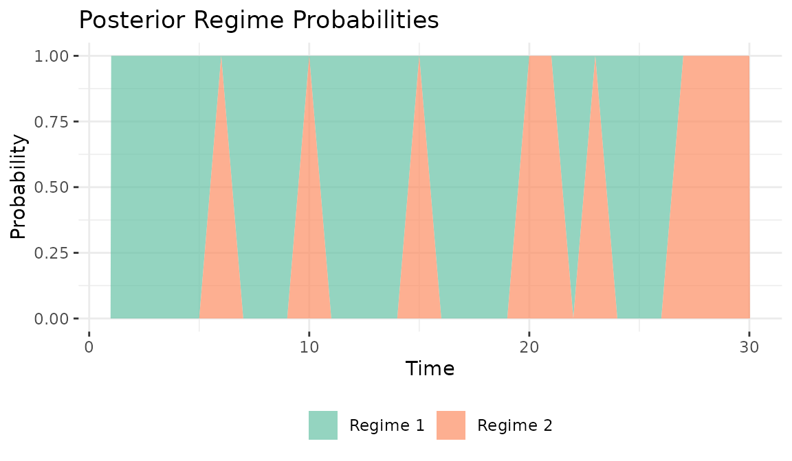
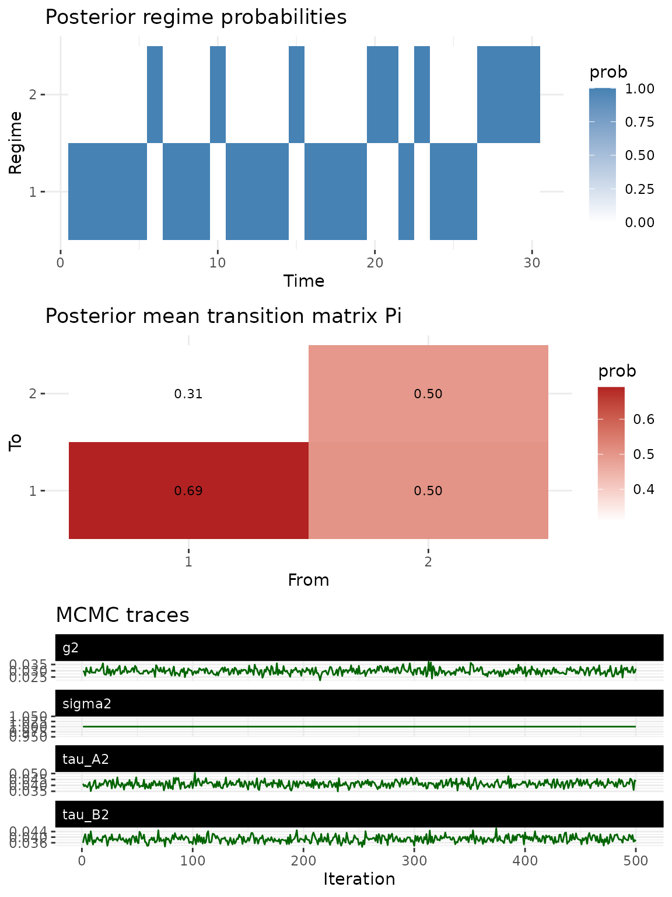
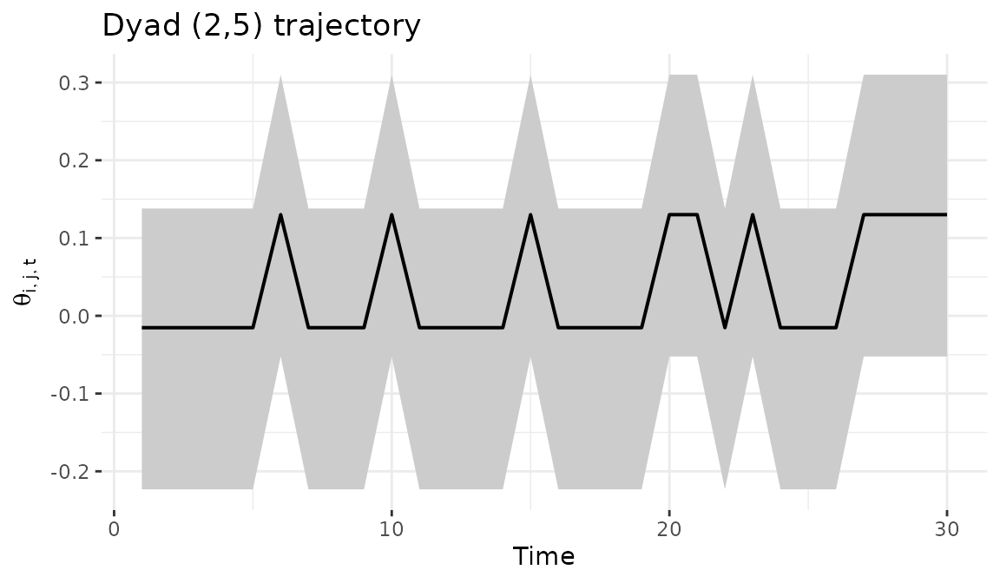

# Regime-switching (HMM) bilinear network models

## 1 Overview

The HMM variant of the dynamic bilinear network model allows for
regime-switching dynamics. At each time point, the network is governed
by one of $R$ discrete regimes, each with its own influence matrices
$A_{r}$ and $B_{r}$. Transitions between regimes follow a Markov chain
with an estimated transition matrix $\Pi$:

$$\Theta_{t} = A_{s_{t}}\,\Theta_{t - 1}\, B_{s_{t}}^{\top} + M + \varepsilon_{t},\quad s_{t} \sim \text{Markov}(\Pi)$$

This model is appropriate when network dynamics exhibit abrupt
structural breaks and the analyst wants the model to discover when those
breaks occur, rather than specifying them in advance. For known break
points, the piecewise model provides more stable inference with fewer
parameters (see
[`vignette("piecewise_dbn")`](https://netify-dev.github.io/dbn/articles/piecewise_dbn.md)).

Regime identification improves with network size, time series length,
and the magnitude of the structural difference between regimes. For
small networks ($n < 15$) or subtle regime changes, the piecewise model
with known break points is a more reliable choice.

## 2 Simulate a regime-switching network

We simulate a two-regime network with 12 actors over 30 time periods.
The high `transition_prob` (0.9) means each regime persists for several
consecutive periods before switching. The large `tau_A2` and `tau_B2`
values (0.8) create regimes with substantially different dynamics, which
is important for reliable regime identification.

``` r
sim = simulate_hmm_dbn(
  n     = 12,
  p     = 1,
  time  = 30,
  R     = 2,
  sigma2        = 0.3,
  tau_A2        = 0.8,
  tau_B2        = 0.8,
  transition_prob = 0.9,
  seed  = 6886
)

dim(sim$Y)
#> [1] 12 12  1 30

# true regime sequence and frequencies
sim$S
#>  [1] 2 2 2 2 2 2 2 2 2 1 2 2 2 2 2 2 2 2 2 1 1 1 1 1 1 1 1 1 1 1
table(sim$S)
#> 
#>  1  2 
#> 12 18
```

The true regime labels show which regime generated each time point. With
two regimes and a transition probability of 0.9, we expect each regime
to persist for an average of 10 consecutive periods before switching.

## 3 Fit the HMM model

We set `model = "hmm"` and specify `R = 2` regimes. The sampler jointly
estimates regime-specific dynamics matrices ($A_{r}$, $B_{r}$), the
transition matrix $\Pi$, and the regime labels $s_{t}$.

``` r
fit = dbn(
  sim$Y,
  model   = "hmm",
  family  = "ordinal",
  R       = 2,
  nscan   = 1000,
  burn    = 500,
  odens   = 2,
  verbose = FALSE
)
```

## 4 Model summary and transition matrix

The summary reports the posterior mean transition matrix $\Pi$ and
variance parameters. The diagonal of $\Pi$ indicates regime persistence:
values near 1 mean regimes tend to stick, while large off-diagonal
values indicate frequent switching.

``` r
summary(fit)
#> Regime-switching (HMM) DBN model
#>   nodes     : 12 
#>   relations : 1 
#>   time pts  : 30 
#>   regimes   : 2 
#> 
#>        mean  2.5%  97.5%
#> sigma2 1.000 1.000 1.000
#> tau_A2 0.041 0.037 0.046
#> tau_B2 0.039 0.035 0.043
#> g2     0.030 0.025 0.034
#> 
#> Posterior mean transition matrix Pi:
#>       [,1]  [,2]
#> [1,] 0.691 0.309
#> [2,] 0.504 0.496
```

Two things to note about the estimated $\Pi$. First, the model’s regime
labels may not match the simulation’s — this is the standard
label-switching issue in mixture models and does not affect the
substantive results. Second, with the moderate chain length used here
(`nscan = 1000`), the transition matrix has substantial posterior
uncertainty. Recovering the true persistence (0.9 on the diagonal)
requires longer chains and larger networks; with $n = 12$ actors and 30
time points, the model has limited data per regime to pin down $\Pi$
precisely. For substantive work, run at least `nscan = 5000` with
`burn = 2000`.

## 5 Regime probabilities

The posterior probability of each regime at each time point provides the
model’s classification of the time series into regimes. Probabilities
near 0 or 1 indicate confident classification; values near 0.5 indicate
ambiguity. Regime identification depends on how different the regimes
are (controlled by `tau_A2` and `tau_B2` in the simulation) and how much
data is available per time point (number of actors).

``` r
plot_regime_probs(fit)
```



The
[`regime_probs()`](https://netify-dev.github.io/dbn/reference/regime_probs.md)
function returns the underlying probability matrix for custom analysis.
Each row sums to 1 across regimes.

``` r
probs = regime_probs(fit)
head(probs, 10)
#>        Regime1 Regime2
#> Time1        1       0
#> Time2        1       0
#> Time3        1       0
#> Time4        1       0
#> Time5        1       0
#> Time6        0       1
#> Time7        1       0
#> Time8        1       0
#> Time9        1       0
#> Time10       0       1
```

## 6 Model diagnostics

The default [`plot()`](https://rdrr.io/r/graphics/plot.default.html)
method for HMM fits provides a combined diagnostic view: regime
probabilities, the estimated transition matrix, and MCMC trace plots for
monitoring convergence.

``` r
plot(fit)
```



## 7 Dyad trajectory

The
[`dyad_path()`](https://netify-dev.github.io/dbn/reference/dyad_path.md)
function tracks a specific bilateral relationship over time with
posterior credible intervals, averaging across regime assignments.

``` r
dyad_path(fit, i = 2, j = 5)
```



## 8 Forecasting

The [`predict()`](https://rdrr.io/r/stats/predict.html) method samples
future regime states from $\Pi$ and propagates the regime-specific
bilinear dynamics forward. This means forecast uncertainty reflects both
posterior uncertainty in $A_{r}$ and $B_{r}$ and uncertainty about which
regime will be active in future periods.

``` r
pred = predict(fit, H = 5, draws = 100, summary = "mean")
dim(pred)
#> [1] 12 12  1  5
```

## 9 When to use HMM

The HMM model is appropriate when network dynamics exhibit discrete
structural breaks (such as policy changes, crises, or regime
transitions) and the analyst wants data-driven discovery of when those
breaks occur. The number of regimes $R$ should be small (2-5), and the
network should have enough actors and time points to identify regime
structure. For smoothly evolving dynamics without discrete breaks,
`model = "dynamic"` is a better choice. For known break points,
`model = "piecewise"` provides more stable inference. For large networks
(50+ actors), `model = "lowrank"` offers better scalability.
