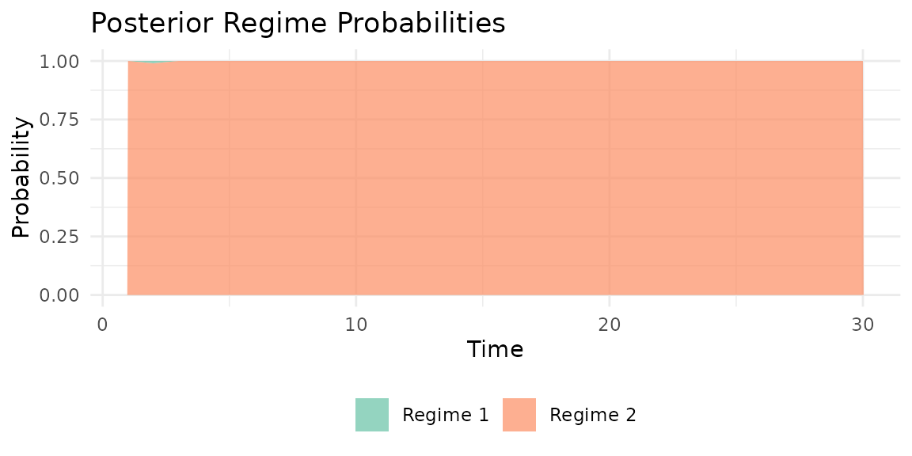
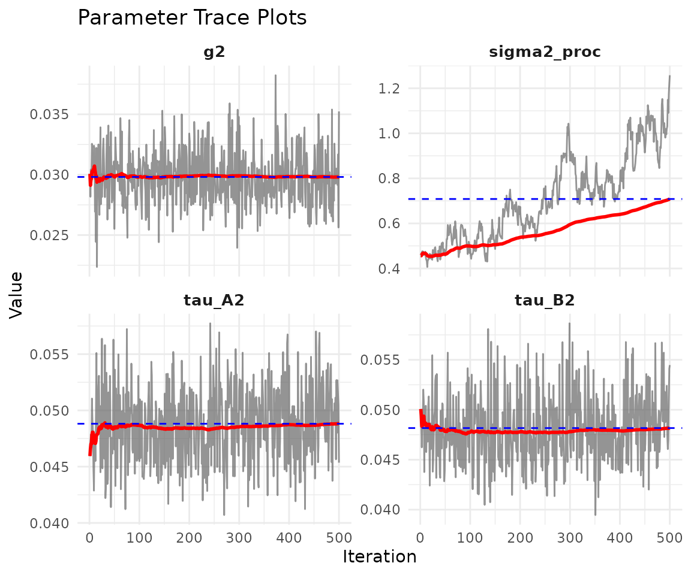
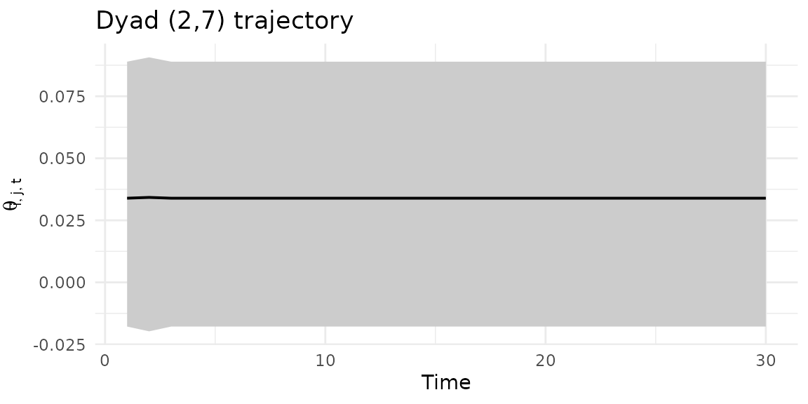

# Regime-switching (HMM) bilinear network models

------------------------------------------------------------------------

**NOTE: This vignette is under construction.** The HMM model variant is
implemented and functional, but the documentation and examples below are
preliminary and subject to change.

------------------------------------------------------------------------

## 1 Overview

The HMM (Hidden Markov Model) variant of the dynamic bilinear network
model allows for **regime-switching** dynamics. At each time point, the
network is governed by one of *R* discrete regimes, each with its own
sender and receiver effect matrices $A_{r}$ and $B_{r}$. Transitions
between regimes follow a Markov chain with an estimated transition
matrix $\Pi$.

Use `model = "hmm"` when you expect **abrupt structural breaks** in
network dynamics rather than smooth evolution.

## 2 Simulate a regime-switching network

``` r
sim <- simulate_hmm_dbn(
  n = 12, p = 1, time = 30,
  R = 2,
  sigma2 = 0.3,
  tau_A2 = 0.15, tau_B2 = 0.15,
  transition_prob = 0.85,
  seed = 42
)

dim(sim$Y)
#> [1] 12 12  1 30
table(sim$S)
#> 
#>  1  2 
#>  6 24
```

The true regime sequence `sim$S` shows how often each regime is active.

## 3 Fit the HMM model

``` r
fit_hmm <- dbn(
  sim$Y,
  model   = "hmm",
  family  = "ordinal",
  R       = 2,
  nscan   = 1000,
  burn    = 500,
  odens   = 2,
  verbose = FALSE
)
```

## 4 Model summary

``` r
summary(fit_hmm)
#> Regime-switching (HMM) DBN model
#>   nodes     : 12 
#>   relations : 1 
#>   time pts  : 30 
#>   regimes   : 2 
#> 
#>        mean  2.5%  97.5%
#> sigma2 0.708 0.443 1.078
#> tau_A2 0.049 0.043 0.055
#> tau_B2 0.048 0.042 0.056
#> g2     0.030 0.026 0.035
#> 
#> Posterior mean transition matrix Pi:
#>       [,1]  [,2]
#> [1,] 0.663 0.337
#> [2,] 0.033 0.967
```

The summary displays the posterior mean transition matrix $\Pi$ and
variance parameters for each regime.

## 5 Regime probabilities

The posterior probability of each regime at each time point:

``` r
probs <- regime_probs(fit_hmm)
head(probs)
#>       Regime1 Regime2
#> Time1    0.00    1.00
#> Time2    0.01    0.99
#> Time3    0.00    1.00
#> Time4    0.00    1.00
#> Time5    0.00    1.00
#> Time6    0.00    1.00
```

Visualize with a stacked area plot:

``` r
plot_regime_probs(fit_hmm)
```



## 6 Model diagnostics

``` r
plot(fit_hmm)
```


Trace plots for scalar parameters:

``` r
plot_trace(fit_hmm)
```



## 7 Dyad trajectory

Track a specific dyad over time with credible intervals:

``` r
dyad_path(fit_hmm, i = 2, j = 7)
```



## 8 Forecasting

Generate multi-step-ahead forecasts:

``` r
pred <- predict(fit_hmm, H = 3, draws = 50, summary = "mean")
dim(pred)
#> [1] 12 12  1  3
```

The predict method samples future regime states from $\Pi$ and
propagates the bilinear dynamics forward.

## 9 When to use HMM

The HMM model is appropriate when:

- Network dynamics exhibit **discrete structural breaks** (e.g., policy
  changes, crises, regime transitions)
- You want to **classify time points** into distinct behavioral regimes
- The number of regimes *R* is relatively small (2–5)

For smoothly evolving dynamics, consider `model = "dynamic"` instead.
For large networks with many nodes, consider `model = "lowrank"`.
