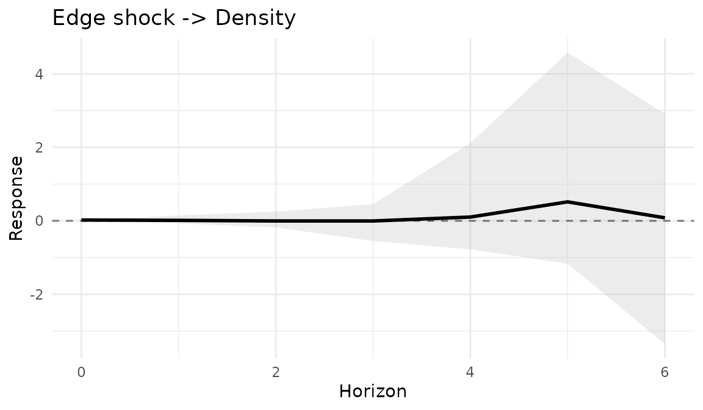
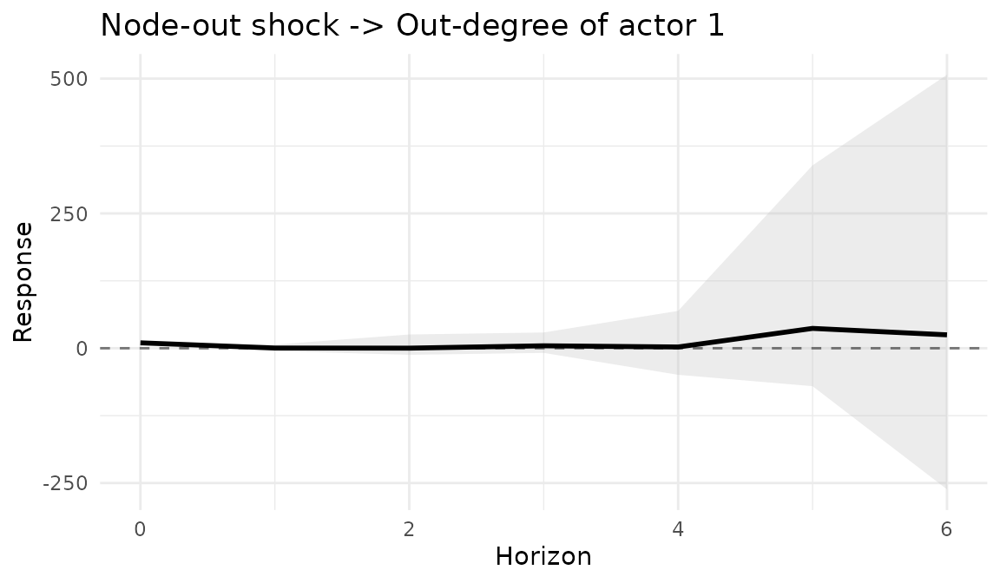
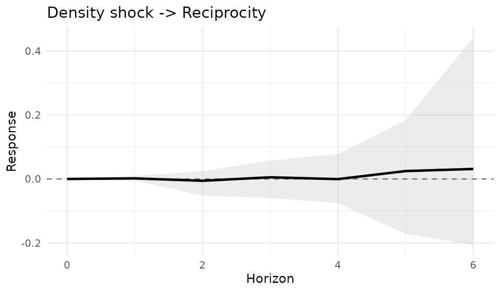
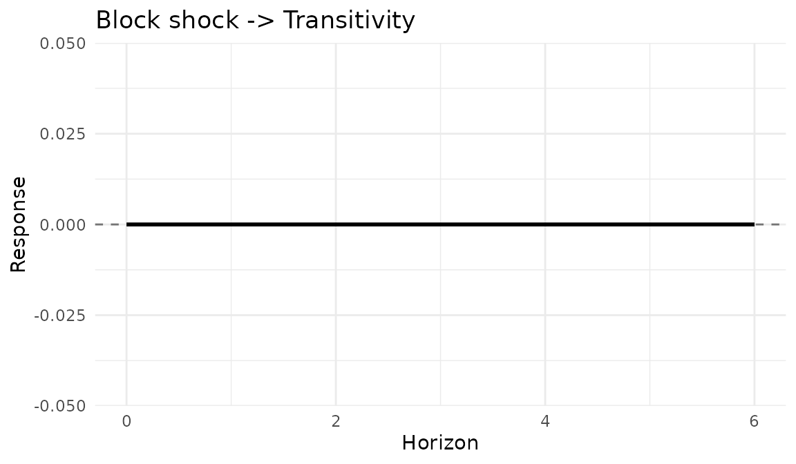
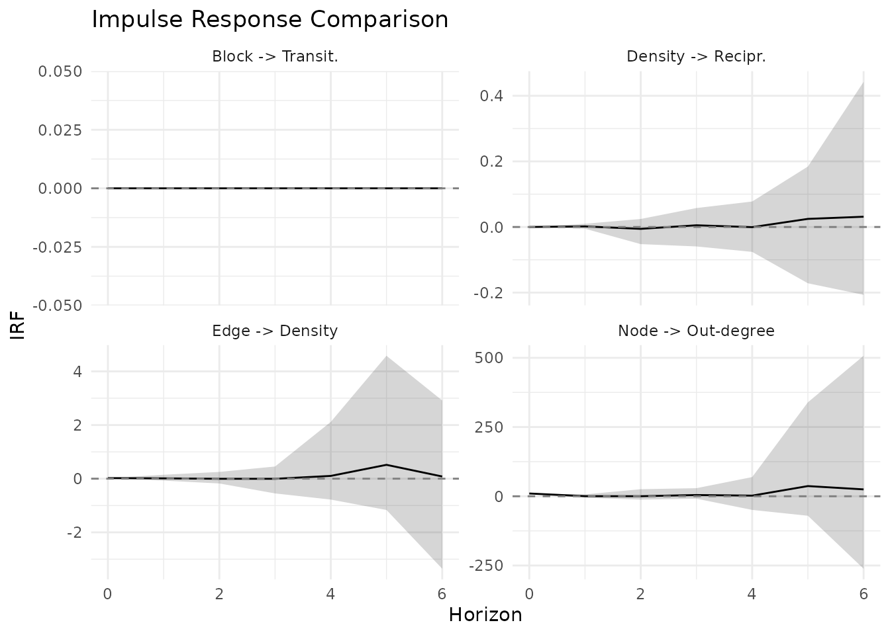

# Impulse response analysis for network models

## 1 Overview

Impulse response functions (IRFs) measure how a **shock** to the network
propagates through the bilinear dynamics over time. Given the model
$\Theta_{t} = A_{t}\Theta_{t - 1}B_{t}\prime + M + \varepsilon_{t}$, we
inject a perturbation $S$ at time $t_{0}$ and track a network-level
statistic (density, degree, reciprocity, etc.) over $H$ horizons.

## 2 Fit a dynamic model

IRFs require a fitted model with time-varying $A$ and $B$ matrices. We
use a Gaussian family for cleaner interpretation. The example below uses
minimal settings for fast vignette building; see Section 8 for
recommended settings in practice.

``` r
sim <- simulate_dynamic_dbn(
  n = 10, p = 1, time = 10,
  sigma2 = 0.3, tauA2 = 0.03, tauB2 = 0.03,
  seed = 123
)

fit <- dbn(
  sim$Y,
  model   = "dynamic",
  family  = "gaussian",
  nscan   = 300,
  burn    = 150,
  odens   = 1,
  verbose = FALSE
)
```

## 3 Building shock matrices

The
[`build_shock()`](https://netify-dev.github.io/dbn/reference/build_shock.md)
function creates structured perturbation matrices:

``` r
m <- 10

# Shock a single edge (i -> j)
S_edge <- build_shock(m, type = "unit_edge", i = 1, j = 2, magnitude = 2)

# Shock all outgoing edges from actor i
S_node <- build_shock(m, type = "node_out", i = 1, magnitude = 1)

# Uniform density shock to all edges
S_dens <- build_shock(m, type = "density", magnitude = 0.5)

# Custom shock matrix
S_custom <- matrix(0, m, m)
S_custom[1:3, 4:6] <- 1.0
```

## 4 Unit edge shock – network density

Track how a single edge shock affects overall network density:

``` r
irf_dens <- compute_irf(
  fit,
  shock    = S_edge,
  H        = 6,
  t0       = 2,
  stat_fun = dbn::stat_density,
  n_draws  = 20
)

plot(irf_dens, title = "Edge shock -> Density")
```



``` r
print(irf_dens)
#> Network Impulse Response Function
#> Model: dynamic 
#> Statistic: custom_function 
#> Shock time: 2 
#> 
#> Summary:
#>   horizon   mean median    sd   q025  q975    q10   q90
#> 1       0  0.022  0.022 0.000  0.022 0.022  0.022 0.022
#> 2       1  0.012 -0.001 0.056 -0.071 0.146 -0.044 0.062
#> 3       2 -0.004  0.013 0.128 -0.178 0.252 -0.154 0.092
#> 4       3 -0.004  0.003 0.268 -0.549 0.454 -0.274 0.334
#> 5       4  0.103 -0.109 0.806 -0.779 2.115 -0.532 1.223
#> 6       5  0.516  0.252 1.711 -1.166 4.581 -1.130 1.165
#> 7       6  0.082  0.192 1.801 -3.356 2.914 -1.565 2.181
```

## 5 Node shock – out-degree

Track the effect of activating all outgoing edges of actor 1 on that
actor’s out-degree:

``` r
irf_deg <- compute_irf(
  fit,
  shock    = S_node,
  H        = 6,
  t0       = 2,
  stat_fun = function(X) stat_out_degree(X)[1],
  n_draws  = 20
)

plot(irf_deg, title = "Node-out shock -> Out-degree of actor 1")
```



## 6 Density shock – reciprocity

How does a uniform perturbation affect reciprocal ties?

``` r
irf_recip <- compute_irf(
  fit,
  shock    = S_dens,
  H        = 6,
  t0       = 2,
  stat_fun = stat_reciprocity,
  n_draws  = 20
)

plot(irf_recip, title = "Density shock -> Reciprocity")
```



## 7 Custom shock – transitivity

``` r
irf_trans <- compute_irf(
  fit,
  shock    = S_custom,
  H        = 6,
  t0       = 2,
  stat_fun = stat_transitivity,
  n_draws  = 20
)

plot(irf_trans, title = "Block shock -> Transitivity")
```



## 8 Comparing multiple shocks

Combine IRF results for a faceted comparison:

``` r
irfs <- list(
  "Edge -> Density"     = irf_dens,
  "Node -> Out-degree"  = irf_deg,
  "Density -> Recipr."  = irf_recip,
  "Block -> Transit."   = irf_trans
)

df_all <- do.call(rbind, lapply(names(irfs), function(nm) {
  d <- irfs[[nm]]
  data.frame(
    horizon = d$horizon,
    mean    = d$mean,
    q025    = d$q025,
    q975    = d$q975,
    shock   = nm
  )
}))

ggplot(df_all, aes(x = horizon, y = mean)) +
  geom_ribbon(aes(ymin = q025, ymax = q975), alpha = 0.2) +
  geom_line() +
  geom_hline(yintercept = 0, linetype = "dashed", color = "grey50") +
  facet_wrap(~shock, scales = "free_y") +
  labs(x = "Horizon", y = "IRF", title = "Impulse Response Comparison") +
  theme_minimal()
```



**Note on settings:** The examples above use small networks (`n = 10`,
`time = 10`) and short MCMC chains (`nscan = 300`) for fast vignette
building. For publication-quality results, increase these settings:

``` r
# Recommended settings for substantive analysis
sim <- simulate_dynamic_dbn(n = 30, p = 1, time = 50, seed = 123)
fit <- dbn(sim$Y, model = "dynamic", family = "gaussian",
           nscan = 5000, burn = 2000, odens = 5, verbose = FALSE)

irf <- compute_irf(fit, shock = S_edge, H = 20, t0 = 25,
                    stat_fun = dbn::stat_density, n_draws = 200)
```

## 9 Available network statistics

The `stat_fun` argument accepts any function that maps a matrix to a
scalar. Built-in statistics:

| Function               | Description                               |
|------------------------|-------------------------------------------|
| `stat_density(X)`      | Mean of off-diagonal entries              |
| `stat_out_degree(X)`   | Row sums (vector)                         |
| `stat_in_degree(X)`    | Column sums (vector)                      |
| `stat_reciprocity(X)`  | Correlation between $X_{ij}$ and $X_{ji}$ |
| `stat_transitivity(X)` | Clustering coefficient                    |

For degree-based statistics, wrap to extract a specific actor:
`function(X) stat_out_degree(X)[i]`.
