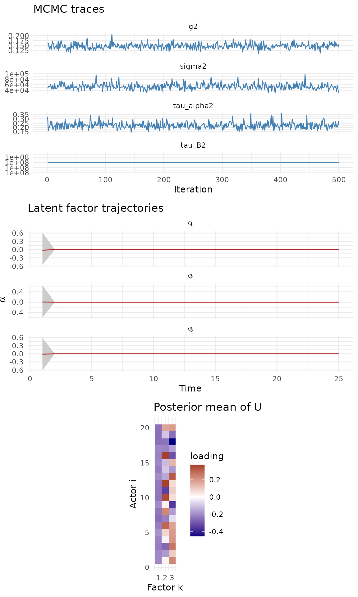
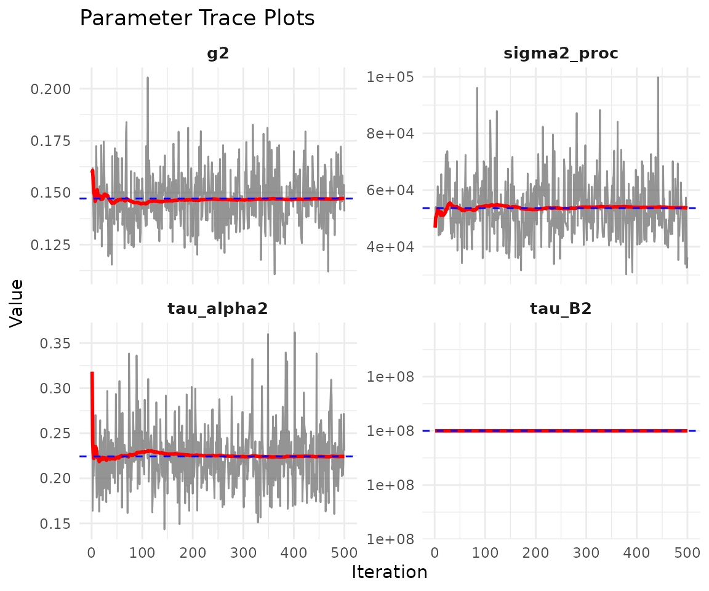
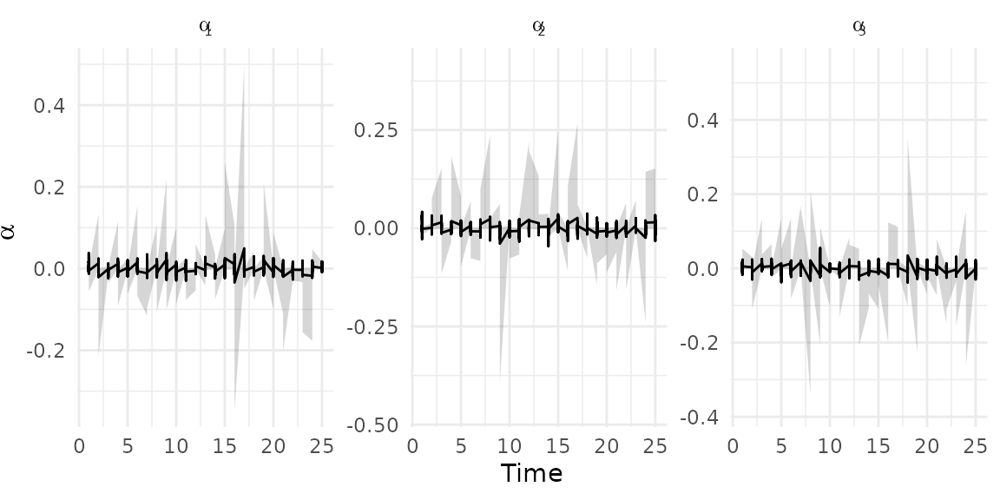
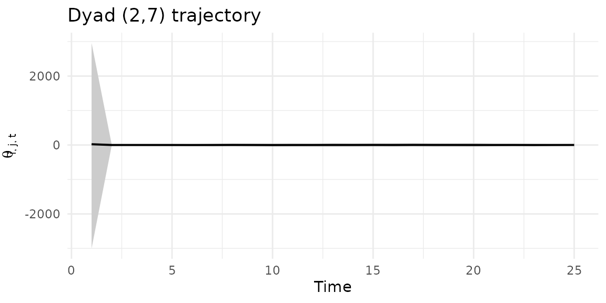

# Low-rank bilinear network models

------------------------------------------------------------------------

**NOTE: This vignette is under construction.** The low-rank model
variant is implemented and functional, but the documentation and
examples below are preliminary and subject to change.

------------------------------------------------------------------------

## 1 Overview

The low-rank model parameterizes the sender dynamics matrix as
$A_{t} = U\,\text{diag}\left( \alpha_{t} \right)\, U\prime$, where $U$
is an orthogonal matrix on the Stiefel manifold and $\alpha_{t}$ is a
vector of time-varying factor strengths. This reduces the number of free
parameters from $m^{2}$ to $m \times r + r$, making it **scalable to
larger networks** (50+ nodes).

Use `model = "lowrank"` when you have many actors and want an
interpretable factor decomposition of sender dynamics.

## 2 Simulate a low-rank network

``` r
sim <- simulate_lowrank_dbn(
  n = 20, p = 1, time = 25,
  r = 3,
  sigma2 = 0.3,
  tau_alpha2 = 0.05,
  tauB2 = 0.03,
  seed = 42
)

dim(sim$Y)
#> [1] 20 20  1 25
```

## 3 Memory estimation

Before fitting, estimate RAM requirements:

``` r
estimate_memory(
  n_row = 20, n_col = 20, p = 1, Tt = 25,
  nscan = 1000, burn = 500, odens = 2,
  family = "ordinal"
)
#> Dynamic DBN memory estimate:
#>   Network:   20 x 20, 1 relation(s), 25 time points
#>   MCMC:      500 draws (nscan=1000, odens=2)
#>   Time thin: 1 (keeping 25 of 25 time points)
#>   --------------------------------
#>   Theta:    0.04 GB
#>   Z:        0.04 GB
#>   A:        0.04 GB
#>   B:        0.04 GB
#>   M:        0.00 GB
#>   --------------------------------
#>   TOTAL:    0.15 GB
```

## 4 Fit the low-rank model

``` r
fit_lr <- dbn(
  sim$Y,
  model   = "lowrank",
  family  = "ordinal",
  r       = 3,
  nscan   = 1000,
  burn    = 500,
  odens   = 2,
  verbose = FALSE
)
```

## 5 Model summary

``` r
summary(fit_lr)
#> Low-rank Dynamic Bilinear Network model
#>   nodes     : 20 
#>   relations : 1 
#>   time pts  : 25 
#>   rank      : 3 
#> 
#>            mean          2.5%          97.5%        
#> sigma2     53627.181     36026.827     73845.273    
#> tau_alpha2 0.224         0.165         0.302        
#> tau_B2     100000000.000 100000000.000 100000000.000
#> g2         0.147         0.124         0.174
```

## 6 Diagnostics

The low-rank plot shows MCMC traces, factor trajectories ($\alpha_{k}$),
and the posterior mean of the node loading matrix $U$:

``` r
plot(fit_lr)
```



Scalar parameter traces:

``` r
plot_trace(fit_lr)
```



## 7 Factor trajectories

Extract factor paths in tidy format for custom plotting:

``` r
alpha_df <- tidy_dbn_lowrank(fit_lr)
head(alpha_df)
#>   time         mean           lo          hi factor
#> 1    1  0.005592911 -0.000964227 0.055901074      1
#> 2    2  0.012913409 -0.001771478 0.133278587      1
#> 3    3 -0.001036149 -0.014762364 0.002559777      1
#> 4    4  0.011527726 -0.001429769 0.115497029      1
#> 5    5  0.001835845 -0.001990556 0.020671729      1
#> 6    6  0.015194571 -0.001874629 0.153809503      1
```

``` r
ggplot(alpha_df, aes(x = time, y = mean)) +
  geom_ribbon(aes(ymin = lo, ymax = hi), alpha = 0.2) +
  geom_line() +
  facet_wrap(~factor, scales = "free_y", labeller = label_bquote(alpha[.(factor)])) +
  labs(x = "Time", y = expression(alpha)) +
  theme_minimal()
```



## 8 Network summaries

``` r
network_summary(fit_lr, stat = "mean")
#>    time         mean        lower      upper
#> 1     1 -0.016963488 -0.133554156 0.10652451
#> 2     2 -0.071594059 -0.194737691 0.04561667
#> 3     3  0.044205511 -0.065582264 0.15674703
#> 4     4 -0.035305902 -0.155793701 0.08353699
#> 5     5  0.065235336 -0.041219114 0.18198592
#> 6     6  0.034864937 -0.086939440 0.15416912
#> 7     7  0.048681795 -0.074496384 0.17595789
#> 8     8 -0.041450857 -0.154804100 0.07708086
#> 9     9 -0.010881969 -0.121945245 0.10504321
#> 10   10 -0.017212752 -0.132423048 0.09727468
#> 11   11  0.066572841 -0.054638830 0.19049804
#> 12   12  0.033831092 -0.080679430 0.14351028
#> 13   13  0.072876656 -0.049944098 0.19132935
#> 14   14  0.108770632 -0.001867272 0.22810640
#> 15   15 -0.069481045 -0.191401586 0.04296959
#> 16   16 -0.095379272 -0.211641938 0.03894659
#> 17   17 -0.093272508 -0.205683728 0.03793006
#> 18   18  0.007502938 -0.110296006 0.12937865
#> 19   19 -0.060462775 -0.188986155 0.06672521
#> 20   20 -0.053412425 -0.163377048 0.06773126
#> 21   21  0.014261183 -0.102147358 0.13489640
#> 22   22 -0.044370732 -0.164914582 0.07917372
#> 23   23  0.018726569 -0.098636484 0.13161020
#> 24   24  0.005837629 -0.111110860 0.11810857
#> 25   25  0.073072749 -0.044764040 0.19066767
network_summary(fit_lr, stat = "density")
#>    time      mean     lower     upper
#> 1     1 0.5020632 0.4709211 0.5315789
#> 2     2 0.4855737 0.4526316 0.5210526
#> 3     3 0.5075368 0.4763158 0.5394737
#> 4     4 0.4949579 0.4605263 0.5315789
#> 5     5 0.5151211 0.4815789 0.5500000
#> 6     6 0.5075263 0.4684211 0.5421053
#> 7     7 0.5109789 0.4761842 0.5447368
#> 8     8 0.4970684 0.4631579 0.5315789
#> 9     9 0.5005789 0.4684211 0.5342105
#> 10   10 0.4951895 0.4605263 0.5289474
#> 11   11 0.5182842 0.4815789 0.5526316
#> 12   12 0.5073684 0.4736842 0.5421053
#> 13   13 0.5064684 0.4710526 0.5421053
#> 14   14 0.5222158 0.4868421 0.5552632
#> 15   15 0.4871421 0.4526316 0.5236842
#> 16   16 0.4826789 0.4473684 0.5157895
#> 17   17 0.4834684 0.4498684 0.5159211
#> 18   18 0.5027895 0.4709211 0.5343421
#> 19   19 0.4861211 0.4500000 0.5210526
#> 20   20 0.4955895 0.4657895 0.5263158
#> 21   21 0.5002421 0.4682895 0.5342105
#> 22   22 0.4923316 0.4552632 0.5290789
#> 23   23 0.5061579 0.4736842 0.5394737
#> 24   24 0.4908421 0.4603947 0.5236842
#> 25   25 0.5149211 0.4789474 0.5500000
edge_prob(fit_lr, threshold = 0)
#>        [,1]  [,2]  [,3]  [,4]  [,5]  [,6]  [,7]  [,8]  [,9] [,10] [,11] [,12]
#>  [1,]    NA 0.622 0.606 0.012 0.002 0.310 0.340 0.380 0.118 0.450 0.412 0.624
#>  [2,] 0.208    NA 0.656 0.068 0.378 0.432 0.120 0.788 0.036 0.488 0.660 0.800
#>  [3,] 0.180 0.202    NA 0.552 0.762 0.742 0.766 0.854 0.080 0.658 0.476 0.826
#>  [4,] 0.096 0.460 0.928    NA 0.916 0.114 0.068 0.700 0.514 0.098 0.630 0.222
#>  [5,] 0.088 0.186 0.512 0.018    NA 0.378 0.840 0.462 0.138 0.220 0.854 0.304
#>  [6,] 0.092 0.874 0.490 0.876 0.998    NA 0.190 0.550 0.982 0.048 0.382 0.694
#>  [7,] 0.580 0.138 0.216 0.620 0.872 0.872    NA 0.892 0.160 0.260 0.786 0.644
#>  [8,] 0.180 0.944 0.982 0.756 0.908 0.890 0.726    NA 0.580 0.586 0.552 0.326
#>  [9,] 0.666 0.154 0.758 0.666 0.550 0.460 0.960 0.350    NA 0.044 1.000 0.200
#> [10,] 0.540 0.722 0.760 0.252 0.990 0.870 0.776 0.812 0.958    NA 0.816 0.590
#> [11,] 0.038 0.722 0.036 0.562 0.712 0.636 0.738 0.696 0.906 0.916    NA 0.830
#> [12,] 0.668 0.606 0.174 0.130 0.260 0.458 0.234 0.706 0.828 0.594 0.532    NA
#> [13,] 0.172 0.616 0.792 0.264 0.924 0.094 0.384 0.232 0.124 0.972 0.904 0.918
#> [14,] 0.168 0.742 0.230 0.834 0.082 0.810 0.936 0.664 0.762 0.634 0.070 0.826
#> [15,] 0.858 0.502 0.068 0.742 0.460 0.164 0.302 0.310 0.120 0.250 0.878 0.278
#> [16,] 0.582 0.216 0.626 0.972 0.396 0.876 0.916 0.076 0.482 0.254 0.832 0.114
#> [17,] 0.286 0.036 0.088 0.190 0.128 0.184 0.370 0.078 0.210 0.590 0.078 0.204
#> [18,] 0.826 0.638 0.674 0.536 0.350 0.802 0.910 0.280 0.050 0.666 0.246 0.740
#> [19,] 0.968 0.906 0.074 0.958 0.054 0.658 0.150 0.978 0.430 0.294 0.346 0.590
#> [20,] 0.330 0.708 0.198 0.778 0.852 0.470 0.148 0.442 0.928 0.680 0.530 0.316
#>       [,13] [,14] [,15] [,16] [,17] [,18] [,19] [,20]
#>  [1,] 0.508 0.756 0.364 0.218 0.948 0.766 0.834 0.578
#>  [2,] 0.776 0.204 0.218 0.094 0.418 0.740 0.848 0.184
#>  [3,] 0.008 0.506 0.194 0.732 0.152 0.830 0.862 0.040
#>  [4,] 0.894 0.450 0.888 0.930 0.460 0.812 0.248 0.304
#>  [5,] 0.628 0.472 0.310 0.492 0.988 0.336 0.908 0.208
#>  [6,] 0.378 0.650 0.692 0.748 0.952 0.344 0.906 0.178
#>  [7,] 0.550 0.130 0.896 0.924 0.276 0.346 0.296 0.460
#>  [8,] 0.816 0.482 0.696 0.176 0.896 0.932 0.926 0.136
#>  [9,] 0.506 0.678 0.928 0.938 0.098 0.688 0.052 0.156
#> [10,] 0.274 0.510 0.402 0.002 0.762 0.858 0.750 0.258
#> [11,] 0.572 0.020 0.932 0.640 0.360 0.802 0.262 0.646
#> [12,] 0.318 0.892 0.828 0.218 0.250 0.852 0.704 0.838
#> [13,]    NA 0.748 0.422 0.818 0.830 0.664 0.378 0.030
#> [14,] 0.186    NA 0.536 0.686 0.252 0.596 0.704 0.280
#> [15,] 0.184 0.244    NA 0.334 0.072 0.110 0.386 0.942
#> [16,] 0.844 0.958 0.210    NA 0.078 0.880 0.822 0.316
#> [17,] 0.172 0.376 0.810 0.094    NA 0.662 0.930 0.630
#> [18,] 0.920 0.284 0.476 0.604 0.434    NA 0.952 0.188
#> [19,] 0.448 0.918 0.386 0.082 0.010 0.714    NA 0.682
#> [20,] 0.680 0.020 0.308 0.756 0.912 0.608 0.968    NA
```

## 9 Dyad trajectory

``` r
dyad_path(fit_lr, i = 2, j = 7)
```



## 10 Forecasting

``` r
pred <- predict(fit_lr, H = 3, draws = 50, summary = "mean")
dim(pred)
#> [1] 20 20  1  3
```

## 11 When to use low-rank

The low-rank model is appropriate when:

- The network has **many actors** (50+) making the full dynamic model
  computationally expensive
- You want an **interpretable factor structure** where $U$ reveals actor
  groupings and $\alpha_{t}$ captures time-varying factor strengths
- The rank $r$ is much smaller than the number of actors

For smaller networks, `model = "dynamic"` provides more flexible
dynamics. For regime-switching behavior, consider `model = "hmm"`.
