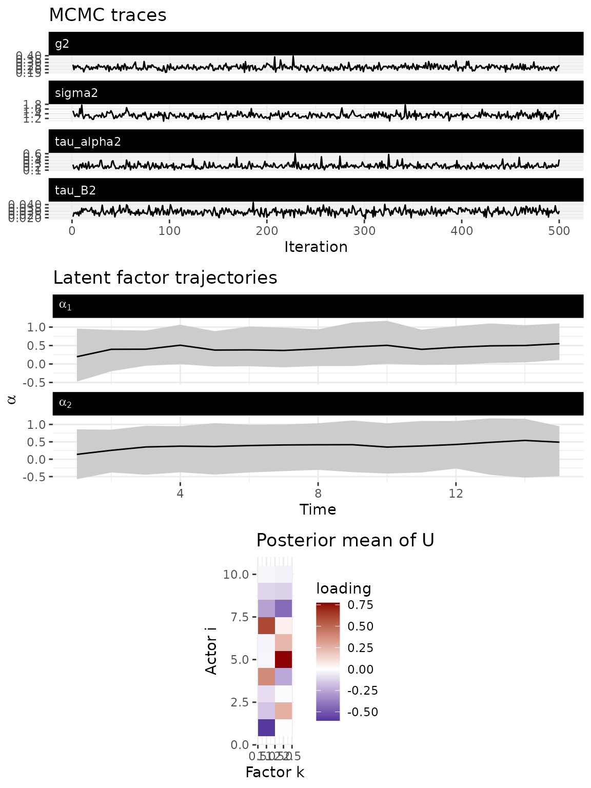
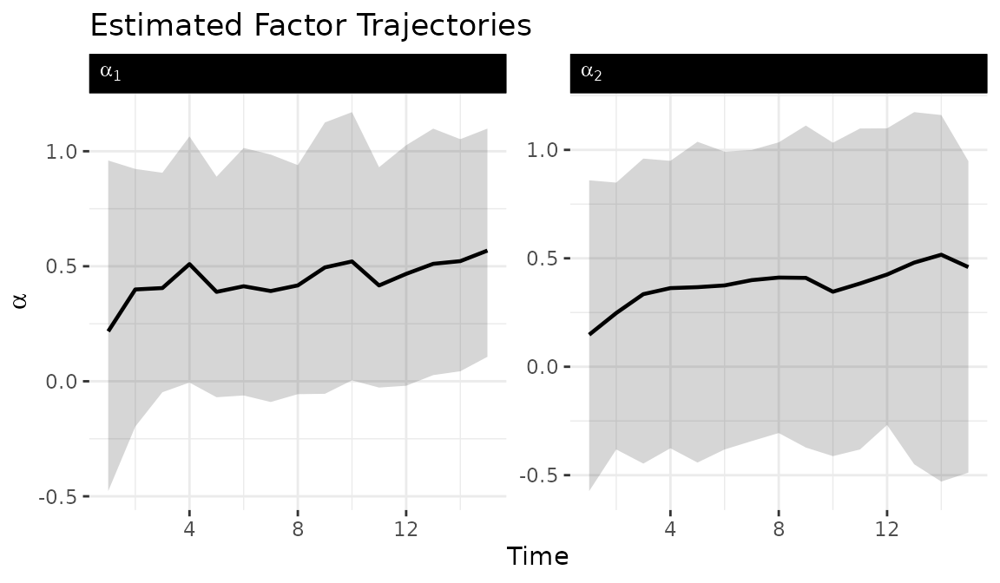

# Low-rank bilinear network models

## 1 Overview

The low-rank model factorizes the sender dynamics matrix as:

$$A_{t} = U\,\text{diag}\left( \alpha_{t} \right)\, U^{\top}$$

where $U$ is an $n \times r$ orthogonal matrix (constrained to the
Stiefel manifold) and $\alpha_{t}$ is a vector of time-varying factor
strengths. This reduces the number of free parameters from $n^{2}$ to
$n \times r + r$. For a 50-actor network, the full dynamic model
requires estimating 2,500 entries per time point, while a rank-3
low-rank model requires only 153 ($50 \times 3 + 3$).

The columns of $U$ define latent groups of actors that share similar
influence patterns. The factor trajectories $\alpha_{t}$ capture how
strongly each latent dimension drives the dynamics at each time point.
This structure makes the model tractable for larger networks where the
full dynamic model becomes prohibitively expensive.

## 2 When to use low-rank

The low-rank model is designed for networks with 50 or more actors where
the full dynamic model is computationally prohibitive. The parameter
savings grow quadratically with network size:

| Network Size | Full Dynamic Parameters | Rank-3 Low-Rank Parameters |
|:------------:|:-----------------------:|:--------------------------:|
|  20 actors   |           400           |             63             |
|  50 actors   |          2,500          |            153             |
|  100 actors  |         10,000          |            303             |

For smaller networks where full flexibility is affordable, use
`model = "dynamic"`. For known structural break points, use
`model = "piecewise"`.

## 3 Memory estimation

Before fitting, check RAM requirements with
[`estimate_memory()`](https://netify-dev.github.io/dbn/reference/estimate_memory.md).
This is particularly important for the low-rank model because its
primary use case is larger networks where memory is the binding
constraint.

``` r
estimate_memory(
  n_row = 50, n_col = 50, p = 1, Tt = 30,
  nscan = 5000, burn = 2000, odens = 5,
  family = "ordinal"
)
#> Dynamic DBN memory estimate:
#>   Network:   50 x 50, 1 relation(s), 30 time points
#>   MCMC:      1000 draws (nscan=5000, odens=5)
#>   Time thin: 1 (keeping 30 of 30 time points)
#>   --------------------------------
#>   Theta:    0.56 GB
#>   Z:        0.56 GB
#>   A:        0.56 GB
#>   B:        0.56 GB
#>   M:        0.02 GB
#>   --------------------------------
#>   TOTAL:    2.25 GB
```

## 4 Simulate data

We simulate a 10-node network with rank $r = 2$, meaning the sender
dynamics are driven by two latent factors. We use the Gaussian family
(`sim$Z`) for this demonstration because it provides sharper factor
identification than the ordinal family at small network sizes. The
model’s primary use case is networks with 50+ actors where the ordinal
family works well; this small example illustrates the API and factor
trajectory interpretation.

``` r
sim = simulate_lowrank_dbn(
  n          = 10,
  p          = 1,
  time       = 15,
  r          = 2,
  sigma2     = 0.3,
  tau_alpha2 = 0.1,
  tauB2      = 0.04,
  seed       = 6886
)

dim(sim$Z)
#> [1] 10 10  1 15
```

## 5 Fit the model

The key argument is `r`, the rank of the factorization. Setting `r` much
smaller than `n` is what makes this model scalable. In practice, $r = 2$
or $r = 3$ captures the dominant dimensions of variation in the
influence structure for most applications.

``` r
fit = dbn(
  sim$Z,
  model   = "lowrank",
  family  = "gaussian",
  r       = 2,
  nscan   = 1000,
  burn    = 500,
  odens   = 2,
  verbose = FALSE
)
```

## 6 Model diagnostics

The default [`plot()`](https://rdrr.io/r/graphics/plot.default.html)
method provides a combined diagnostic view: MCMC trace plots for scalar
parameters, estimated factor trajectories ($\alpha_{k}$ over time), and
the posterior mean of the node loading matrix $U$.

``` r
plot(fit)
```



## 7 Factor trajectories

The
[`tidy_dbn_lowrank()`](https://netify-dev.github.io/dbn/reference/tidy_dbn_lowrank.md)
function extracts factor trajectories in tidy format for custom
visualization. Ribbons show 95% posterior credible intervals.

``` r
alpha_df = tidy_dbn_lowrank(fit)

ggplot(alpha_df, aes(x = time, y = mean)) +
  geom_ribbon(aes(ymin = lo, ymax = hi), alpha = 0.2) +
  geom_line(linewidth = 0.8) +
  facet_wrap(
    ~ factor, scales = "free_y",
    labeller = label_bquote(alpha[.(factor)])
  ) +
  labs(
    title = "Estimated Factor Trajectories",
    x = "Time", y = expression(alpha)
  ) +
  theme_bw() +
  theme(
    panel.border = element_blank(),
    strip.background = element_rect(fill = "black", color = "black"),
    strip.text.x = element_text(color = "white", hjust = 0)
  )
```



## 8 Model summary

``` r
summary(fit)
#> Low-rank Dynamic Bilinear Network model
#>   nodes     : 10 
#>   relations : 1 
#>   time pts  : 15 
#>   rank      : 2 
#> 
#>            mean  2.5%  97.5%
#> sigma2     1.328 1.163 1.531
#> tau_alpha2 0.224 0.134 0.396
#> tau_B2     0.029 0.022 0.038
#> g2         0.229 0.177 0.299
```

## 9 Forecasting

Forecasts propagate both the factor dynamics $\alpha_{t}$ and the
receiver dynamics $B_{t}$ forward, generating forecast distributions
that reflect uncertainty in all model parameters.

``` r
pred = predict(fit, H = 3, draws = 100, summary = "mean")
dim(pred)
#> [1] 10 10  1  3
```

## 10 Choosing the rank

Start with $r = \lceil\log_{2}(n)\rceil$ and increase if posterior
predictive checks show poor fit. Compare models with different ranks
using
[`compare_dbn()`](https://netify-dev.github.io/dbn/reference/compare_dbn.md).
Factors whose $\alpha_{t}$ trajectories remain near zero throughout the
time series contribute little and suggest a lower rank suffices.

## 11 Next steps

For the full dynamic model without low-rank constraints, see
[`vignette("dynamic_dbn")`](https://netify-dev.github.io/dbn/articles/dynamic_dbn.md).
For impulse response analysis, see
[`vignette("impulse_response")`](https://netify-dev.github.io/dbn/articles/impulse_response.md).
For the mathematical framework underlying all model variants, see
[`vignette("methodology")`](https://netify-dev.github.io/dbn/articles/methodology.md).
