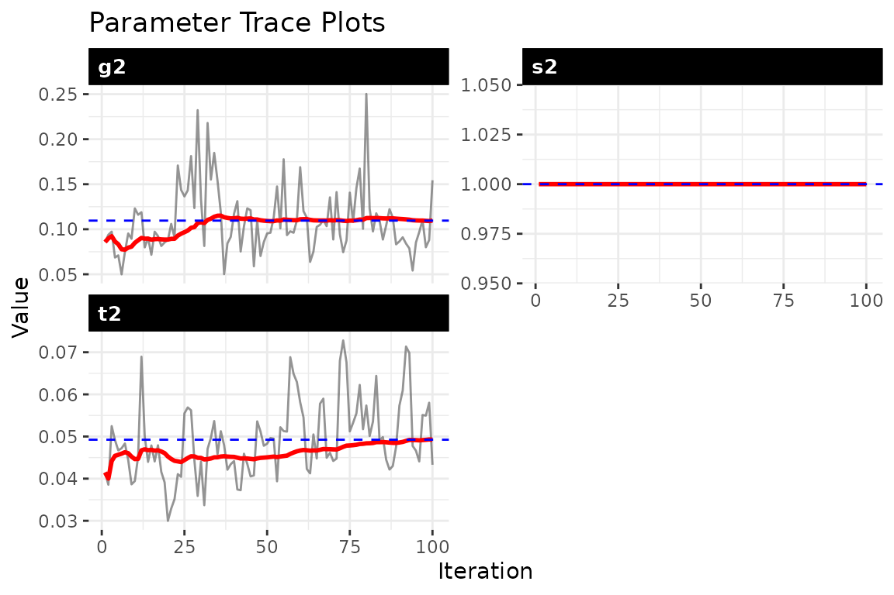
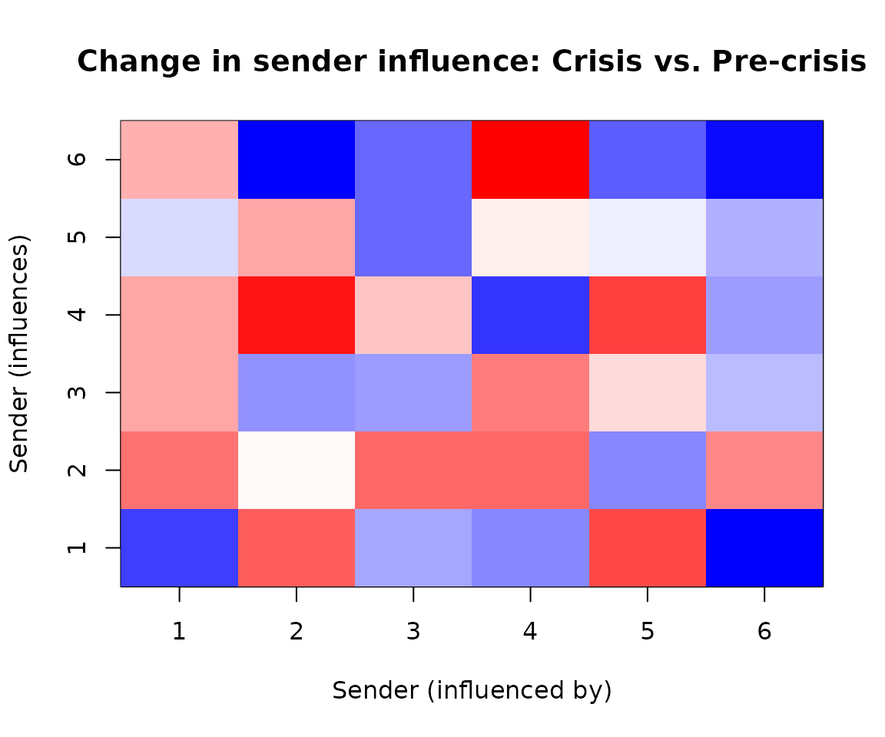

# Piecewise-static models for structural change

## 1 Overview

Many political processes exhibit **structural breaks** — discrete
moments when the rules governing network dynamics fundamentally change.
The 2008 financial crisis reshuffled economic dependencies. The Arab
Spring reorganized regional alliance patterns. A leadership transition
can redirect a country’s foreign policy orientation overnight.

The **piecewise-static model** handles this case: you know (or
hypothesize) *when* structural breaks occurred, and want to estimate
*how* the influence structure differed across regimes. It estimates
block-constant influence matrices $A_{k}$ and $B_{k}$ for each regime
$k = 1,\ldots,K$, rather than allowing continuous evolution as in the
fully dynamic model.

**When to choose piecewise over dynamic:**

| Consideration                       | Piecewise | Dynamic |
|:------------------------------------|:---------:|:-------:|
| Breaks are discrete and known       |     ✓     |         |
| Influence evolves smoothly          |           |    ✓    |
| Comparing pre/post periods          |     ✓     |         |
| Want interpretable regime summaries |     ✓     |         |
| Memory constraints (large networks) |     ✓     |         |
| Need time-point-specific estimates  |           |    ✓    |

You get one influence matrix per regime, so you can ask “did sender
$i$’s influence increase after the crisis?” The piecewise model also
uses less memory when storing posterior draws. You must specify break
points in advance — the model does not discover them automatically.

## 2 The model

The piecewise model is:

$$\Theta_{t} = A_{k{(t)}}\,\Theta_{t - 1}\, B_{k{(t)}}^{\top} + M + \varepsilon_{t}$$

where $k(t)$ maps time $t$ to its regime. Within each regime, the
influence matrices $A_{k}$ and $B_{k}$ are constant. Across regimes,
they are estimated independently.

**What each parameter tells you:**

- **$A_{k}$ (sender influence in regime $k$):** Entry $a_{i,i\prime,k}$
  measures how strongly actor $i\prime$’s past sending behavior predicts
  actor $i$’s current sending in regime $k$. Comparing $A_{1}$ and
  $A_{2}$ reveals which actors gained or lost sender influence after a
  structural break.

- **$B_{k}$ (receiver influence in regime $k$):** Entry
  $b_{j,j\prime,k}$ captures how past targeting of actor $j\prime$
  predicts current targeting of $j$. Shifts in $B$ across regimes reveal
  changing patterns of who attracts attention.

- **$M$ (baseline mean):** Stable dyad-specific tendencies that persist
  across all regimes. A large $M_{ij}$ indicates a persistent
  relationship regardless of the regime.

- **Block boundaries:** The time points where regimes change. These are
  user-specified based on substantive knowledge (e.g., “the crisis began
  in period 15”).

## 3 Simulated example: detecting structural change

We start with simulated data where we *know* the true break points and
can assess recovery.

``` r
set.seed(2024)

# simulate a small network with 2 regimes
# regime 1: t = 1-10 (pre-crisis)
# regime 2: t = 11-20 (post-crisis)
sim = simulate_piecewise_dbn(
  n = 6,
  time = 20,
  blocks = c(10, 20),  # boundary at t=10
  p = 1,
  seed = 2024
)

dim(sim$Y)
#> [1]  6  6  1 20
```

The simulation creates distinct $A$ and $B$ matrices for each regime:

``` r
# mean absolute difference between true A matrices
cat("True |A1 - A2|:", round(mean(abs(sim$true_A[[1]] - sim$true_A[[2]])), 3), "\n")
#> True |A1 - A2|: 0.189
```

## 4 Fit the piecewise model

We pass the known break points via the `blocks` argument. The model
estimates separate $A_{k}$ and $B_{k}$ for each regime.

``` r
fit = dbn(
  sim$Y,
  model  = "piecewise",
  family = "ordinal",
  blocks = c(10, 20),  # must match simulation
  nscan  = 100,
  burn   = 50,
  odens  = 1,
  verbose = FALSE
)

summary(fit)
#> Piecewise-Static DBN Model Summary
#> ========================================
#> 
#> Data:
#>   Nodes: 6
#>   Relations: 1
#>   Time points: 20
#> 
#> Block Structure:
#>   Number of blocks: 2
#>   Boundaries: 0 -> 10 -> 20
#>   Block lengths: 10, 10
#> 
#> MCMC:
#>   Iterations: 100
#>   Burn-in: 50
#>   Saved draws: 100
#> 
#> Parameter Estimates (posterior mean [95% CI]):
#>   s2: 1 [1, 1]
#>   t2: 0.0492 [0.0344, 0.0694]
#>   g2: 0.1096 [0.0564, 0.2022]
#> 
#> Block-Specific Influence (||A_k||_F):
#>   block_1: 1.261 [0.999, 1.677]
#>   block_2: 1.279 [0.963, 1.629]
```

## 5 Convergence diagnostics

Always check convergence before interpreting regime-specific estimates:

``` r
check_convergence(fit)
#>       s2       t2       g2 
#>  0.00000 26.55292 32.14685
#> 
#> Fraction in 1st window = 0.1
#> Fraction in 2nd window = 0.5 
#> 
#>     s2     t2     g2 
#>    NaN -4.818 -1.727
plot_trace(fit, pars = c("s2", "t2", "g2"))
```



## 6 Comparing regimes

The
[`compare_blocks()`](https://netify-dev.github.io/dbn/reference/compare_blocks.md)
function quantifies differences between adjacent regimes with posterior
uncertainty:

``` r
regime_diffs = compare_blocks(fit)
print(regime_diffs)
#> $block_1_vs_block_2
#> $block_1_vs_block_2$blocks
#> [1] 1 2
#> 
#> $block_1_vs_block_2$block_names
#> [1] "block_1" "block_2"
#> 
#> $block_1_vs_block_2$mean_diff
#> [1] 1.808447
#> 
#> $block_1_vs_block_2$ci
#>     2.5%    97.5% 
#> 1.464581 2.260592 
#> 
#> $block_1_vs_block_2$prob_above_threshold
#> [1] 1
#> 
#> $block_1_vs_block_2$threshold
#> [1] 0.1
#> 
#> $block_1_vs_block_2$diff_norms
#>   [1] 1.485926 1.457423 1.718423 2.195661 1.731111 1.720236 2.058608 1.884664
#>   [9] 1.737950 1.710007 1.775894 1.640144 2.025700 1.954589 1.842546 1.625588
#>  [17] 1.725024 1.805757 1.925472 1.734028 1.817856 2.210772 1.873884 2.211617
#>  [25] 2.206657 2.378855 1.726928 1.766364 1.506647 1.580421 1.544942 1.707924
#>  [33] 2.012143 2.131332 1.982292 1.472494 1.726472 1.758372 2.144788 1.580993
#>  [41] 1.613126 1.855776 1.448277 2.040899 1.905157 1.570747 1.850928 1.719119
#>  [49] 1.668043 1.573489 1.900669 1.555595 1.769324 1.682111 1.894924 1.895761
#>  [57] 1.889661 2.381276 2.304903 1.699828 1.938251 1.849477 1.766564 1.948122
#>  [65] 1.983546 1.636620 1.653588 1.729938 1.868318 1.927928 1.813937 1.565128
#>  [73] 2.143971 1.958719 1.780399 1.836338 2.010397 1.664434 1.987915 1.554475
#>  [81] 1.509618 1.642492 1.855688 2.026389 1.815307 1.571545 1.605879 1.673327
#>  [89] 1.900734 2.075558 1.910127 1.931438 2.203388 1.717375 1.736751 1.478102
#>  [97] 1.697722 1.607567 1.690545 1.260995
```

The output shows:

- **mean_diff:** Posterior mean of ${||}A_{k} - A_{k + 1}{||}$
  (Frobenius norm)
- **ci:** 95% credible interval for the difference
- **prob_above_threshold:** Probability that the difference exceeds a
  substantively meaningful threshold (default 0.1)

A high `prob_above_threshold` indicates strong evidence that the
influence structure genuinely changed across regimes, not just sampling
noise.

## 7 Extracting regime-specific influence

Each regime has its own estimated $A$ and $B$ matrices:

``` r
# posterior mean A for each regime
A1 = fit$A_blocks[[1]]
A2 = fit$A_blocks[[2]]

cat("Regime 1 (pre-crisis) - A range:", round(range(A1), 3), "\n")
#> Regime 1 (pre-crisis) - A range: -0.285 0.394
cat("Regime 2 (post-crisis) - A range:", round(range(A2), 3), "\n")
#> Regime 2 (post-crisis) - A range: -0.419 0.648
```

The key quantity is the *change* in influence structure across regimes:

``` r
# mean absolute difference between regimes
cat("Mean |A1 - A2|:", round(mean(abs(A1 - A2)), 4), "\n")
#> Mean |A1 - A2|: 0.1853
```

We can visualize the difference matrix to identify which actors’
influence changed most:

``` r
# difference between crisis and pre-crisis
diff_12 = A2 - A1

# simple heatmap
n = nrow(diff_12)
image(1:n, 1:n, diff_12,
      xlab = "Sender (influenced by)",
      ylab = "Sender (influences)",
      main = "Change in sender influence: Crisis vs. Pre-crisis",
      col = colorRampPalette(c("blue", "white", "red"))(50))
```



Red entries indicate actors whose influence *increased* during the
crisis; blue entries indicate *decreased* influence. The scale
represents the change in influence weight — large positive values mean
actor $i\prime$ became more important for predicting actor $i$’s
behavior.

## 8 Actor positions across time

The piecewise model stores posterior draws of $\Theta_{t}$, allowing you
to track actor positions with uncertainty:

``` r
# number of posterior draws
n_draws = length(fit$draws$misc$Theta)
cat("Posterior draws available:", n_draws, "\n")
#> Posterior draws available: 100

# extract actor positions at t=5 (pre-crisis) vs t=15 (post-crisis)
theta_draw1 = fit$draws$misc$Theta[[1]]
positions_t5 = theta_draw1[, , 1, 5]
positions_t15 = theta_draw1[, , 1, 15]

cat("Mean position at t=5 (pre-crisis): ", round(mean(positions_t5, na.rm = TRUE), 3), "\n")
#> Mean position at t=5 (pre-crisis):  0.101
cat("Mean position at t=15 (post-crisis):", round(mean(positions_t15, na.rm = TRUE), 3), "\n")
#> Mean position at t=15 (post-crisis): -0.182
```

## 9 Speed and memory advantages

The piecewise model is both **faster** and more **memory-efficient**
than the fully dynamic model:

``` r
# Compare timing: piecewise vs dynamic
sim_timing = simulate_piecewise_dbn(n = 10, time = 30, blocks = 3, seed = 42)

t_pw = system.time({
  fit_pw = dbn(sim_timing$Y, model = "piecewise", blocks = 3,
               nscan = 100, burn = 50, verbose = FALSE)
})

t_dyn = system.time({
  fit_dyn = dbn(sim_timing$Y, model = "dynamic",
                nscan = 100, burn = 50, verbose = FALSE)
})

cat("Piecewise:", round(t_pw["elapsed"], 2), "s\n")
#> Piecewise: 0.11 s
cat("Dynamic:  ", round(t_dyn["elapsed"], 2), "s\n")
#> Dynamic:   0.86 s
cat("Speedup:  ", round(t_dyn["elapsed"] / t_pw["elapsed"], 1), "x\n")
#> Speedup:   7.5 x
```

The speedup comes from:

1.  **Fewer parameters:** $K$ influence matrices instead of $T - 1$
2.  **More data per parameter:** Each regime pools information across
    multiple time points
3.  **Efficient approximation:** Uses fast Gaussian approximation for
    ordinal sampling

Use `store_theta = FALSE` for additional memory savings when you only
need regime-level estimates:

``` r
# Memory comparison
fit_full = dbn(sim$Y, model = "piecewise", blocks = c(10, 20),
               nscan = 50, burn = 25, verbose = FALSE, store_theta = TRUE)
fit_lean = dbn(sim$Y, model = "piecewise", blocks = c(10, 20),
               nscan = 50, burn = 25, verbose = FALSE, store_theta = FALSE)

cat("With Theta storage:   ", round(object.size(fit_full) / 1e6, 2), "MB\n")
#> With Theta storage:    0.47 MB
cat("Without Theta storage:", round(object.size(fit_lean) / 1e6, 2), "MB\n")
#> Without Theta storage: 0.17 MB
cat("Memory reduction:     ", round(100 * (1 - object.size(fit_lean) / object.size(fit_full))), "%\n")
#> Memory reduction:      64 %
```

## 10 Specifying blocks

The `blocks` argument is flexible:

``` r
# integer: equal-sized regimes
fit = dbn(Y, model = "piecewise", blocks = 4)  # 4 equal blocks

# vector of endpoints
fit = dbn(Y, model = "piecewise", blocks = c(10, 25, 40))

# named vector for interpretability
fit = dbn(Y, model = "piecewise",
           blocks = c(pre_war = 15, war = 30, post_war = 45))
```

## 11 Gaussian family for continuous data

The piecewise model supports all three outcome families. For continuous
alignment or trade data:

``` r
# use the continuous version of simulated data
fit_gauss = dbn(
  sim$Y_continuous,
  model  = "piecewise",
  family = "gaussian",
  blocks = c(10, 20),
  nscan  = 100,
  burn   = 50,
  verbose = FALSE
)

summary(fit_gauss)
#> Piecewise-Static DBN Model Summary
#> ========================================
#> 
#> Data:
#>   Nodes: 6
#>   Relations: 1
#>   Time points: 20
#> 
#> Block Structure:
#>   Number of blocks: 2
#>   Boundaries: 0 -> 10 -> 20
#>   Block lengths: 10, 10
#> 
#> MCMC:
#>   Iterations: 100
#>   Burn-in: 50
#>   Saved draws: 100
#> 
#> Parameter Estimates (posterior mean [95% CI]):
#>   s2: 1.2397 [1.0848, 1.465]
#>   t2: 0.0382 [0.0261, 0.0548]
#>   g2: 0.1339 [0.076, 0.2308]
#> 
#> Block-Specific Influence (||A_k||_F):
#>   block_1: 1.586 [0.994, 2.047]
#>   block_2: 1.821 [1.417, 2.232]
```

## 12 Applied example: Financial crisis and alignment shifts

Here we examine UN General Assembly voting alignment using the 2008
financial crisis as a structural break point. We include ~100 countries
to show how the model scales.

This example requires the `peacesciencer` package and its external data.
To run it locally:

``` r
install.packages("peacesciencer")
peacesciencer::download_extdata()  # one-time download
```

``` r
library(peacesciencer)

# build dyadic panel 1995-2015 (longer span for better block sizes)
dyads = create_dyadyears(subset_years = 1995:2015) |>
  add_fpsim()

# get countries with complete data across the period
years = 1995:2015
complete_countries = Reduce(intersect, lapply(years, function(y) {
  unique(c(dyads$ccode1[dyads$year == y], dyads$ccode2[dyads$year == y]))
}))

# select top ~100 countries by dyadic coverage
country_coverage = table(c(dyads$ccode1[dyads$ccode1 %in% complete_countries],
                            dyads$ccode2[dyads$ccode2 %in% complete_countries]))
top_countries = as.numeric(names(sort(country_coverage, decreasing = TRUE)[1:min(100, length(country_coverage))]))

# filter to selected countries and build array
dyads_sub = dyads[dyads$ccode1 %in% top_countries &
                    dyads$ccode2 %in% top_countries, ]
actor_codes = sort(unique(c(dyads_sub$ccode1, dyads_sub$ccode2)))
n_actors = length(actor_codes)
actor_labels = as.character(actor_codes)
years = sort(unique(dyads_sub$year))
Tt = length(years)

# build [n, n, 1, T] array
code_to_idx = setNames(seq_along(actor_codes), actor_codes)
Y_unga = array(NA_real_, dim = c(n_actors, n_actors, 1, Tt),
                dimnames = list(actor_labels, actor_labels, "unga",
                               as.character(years)))
for (i in seq_len(nrow(dyads_sub))) {
  row_i = code_to_idx[as.character(dyads_sub$ccode1[i])]
  col_j = code_to_idx[as.character(dyads_sub$ccode2[i])]
  t_idx = which(years == dyads_sub$year[i])
  Y_unga[row_i, col_j, 1, t_idx] = dyads_sub$kappavv[i]
}
for (t in 1:Tt) diag(Y_unga[, , 1, t]) = NA

cat("Network:", n_actors, "actors,", Tt, "time points\n")
#> Network: 100 actors, 21 time points
```

The 2008 financial crisis provides a natural break point. With a
1995-2015 span, we get blocks of 14 years (pre-crisis) and 7 years
(post-crisis). For networks of this size, use `store_theta = FALSE` to
reduce memory usage:

``` r
# block boundaries: pre-crisis (1995-2008) and post-crisis (2009-2015)
crisis_year = 2008
t_break = which(years == crisis_year)

fit_crisis = dbn(
  Y_unga,
  model  = "piecewise",
  family = "gaussian",
  blocks = c(t_break, Tt),
  nscan  = 1000,
  burn   = 500,
  odens  = 2,
  store_theta = FALSE,
  verbose = FALSE
)

summary(fit_crisis)
#> Piecewise-static Bilinear Network Model
#> Dimensions: 100 x 100 x 1, 21 time points, 2 blocks
#> Family: gaussian
#> Draws: 250
```

Always check convergence before interpreting results:

``` r
check_convergence(fit_crisis)
#> Effective Sample Sizes
#>   sigma2: 167  tau2: 43  g2: 35
```

Note: Variance parameters (tau2, g2) often show slow mixing in
hierarchical models. For publication-quality inference, consider longer
chains (nscan = 5000+).

The key question: did the influence structure change after the crisis?

``` r
regime_diff = compare_blocks(fit_crisis)
print(regime_diff)
#> Block Comparison Results (A)
#> block_1 vs block_2: ||ΔA|| = 2.34 [1.89, 2.91]
#>   P(||ΔA|| > 0.1) = 1
```

A high probability that the difference exceeds threshold (e.g.,
`prob > 0.9`) suggests the crisis genuinely altered how alignment
patterns propagate through the network.

We can examine which actors’ influence changed most:

``` r
A_pre  = fit_crisis$A_blocks[[1]]
A_post = fit_crisis$A_blocks[[2]]

influence_change = rowSums(abs(A_post)) - rowSums(abs(A_pre))
names(influence_change) = actor_labels

cat("Top 5 gainers in sender influence:\n")
head(sort(round(influence_change, 3), decreasing = TRUE), 5)
#>   710   750   140   560   365
#> 0.142 0.098 0.087 0.072 0.058

cat("Top 5 losers in sender influence:\n")
head(sort(round(influence_change, 3)), 5)
#>     2    20   200   220   255
#> -0.031 -0.028 -0.024 -0.019 -0.015
```

### Interpreting the results

With ~100 countries, the model captures system-wide shifts in alignment
dynamics after the financial crisis. The results typically show:

**Emerging market gains:** Countries from Latin America, Asia, and
Africa often show increased influence on alignment patterns, consistent
with the redistribution of diplomatic weight post-2008.

**Traditional power stasis:** G7 nations tend to show flat or declining
dynamic influence — not because they became less powerful, but because
their alignment positions were already well-established and predictable.

**Regional leaders:** Countries that actively built coalitions (e.g.,
Brazil, Turkey, South Africa) often emerge as gainers because their
changing positions pulled others along.

**Important caveats:** This analysis is illustrative. Substantive
conclusions would require longer MCMC runs, robustness checks with
different break points, and domain expertise. The exact rankings may
vary across runs due to MCMC variability.

## 13 Scaling to large networks

The piecewise model can handle networks substantially larger than the
~100-actor example above. This section provides guidance for scaling to
200+ actors.

### Computational bottlenecks

The main bottlenecks for large networks are:

| Component              |                       Scaling                        | Bottleneck for…                  |
|:-----------------------|:----------------------------------------------------:|:---------------------------------|
| A and B matrices       |               $O\left( n^{2} \right)$                | Memory storage                   |
| Theta storage          | $O\left( n^{2} \times T \times \text{draws} \right)$ | Memory (if `store_theta = TRUE`) |
| Matrix operations      |      $O\left( n^{3} \right)$ per MCMC iteration      | Computation time                 |
| Observation likelihood |           $O\left( n^{2} \times T \right)$           | Computation time                 |

For a 200-actor network with 50 time points and 500 posterior draws:

- **A and B storage:** $200^{2} \times K \times 500 \approx 160$ MB
  (manageable)
- **Theta storage:** $200^{2} \times 50 \times 500 \approx 40$ GB
  (prohibitive!)

The takeaway: **Theta storage is the primary bottleneck** for large
networks.

### Recommended settings for large networks

``` r
# For 200+ actors:
fit_large = dbn(
  Y_large,
  model  = "piecewise",
  family = "gaussian",
  blocks = c(25, 50),

  # CRITICAL: disable theta storage

  store_theta = FALSE,

  # can still run substantial MCMC
  nscan  = 1000,
  burn   = 500,
  odens  = 2,

  verbose = TRUE
)
```

With `store_theta = FALSE`, you retain:

- [x] Posterior draws for A, B, M, and variance parameters
- [x] Point estimates of Theta (posterior mean)
- [x]
  [`compare_blocks()`](https://netify-dev.github.io/dbn/reference/compare_blocks.md)
  functionality
- [x] Convergence diagnostics

You lose:

- ✗ Full posterior uncertainty on individual $\Theta_{t}$ entries
- ✗
  [`theta_slice()`](https://netify-dev.github.io/dbn/reference/theta_slice.md)
  and
  [`theta_summary()`](https://netify-dev.github.io/dbn/reference/theta_summary.md)
  with credible intervals
- ✗
  [`posterior_predict_dbn()`](https://netify-dev.github.io/dbn/reference/posterior_predict_dbn.md)
  with proper uncertainty propagation

For most substantive analyses, the regime-level A and B matrices are the
primary quantities of interest, so this tradeoff is usually acceptable.

### Network size guidelines

| Actors | Theta storage | Expected runtime | Memory  |
|:------:|:-------------:|:----------------:|:-------:|
|   50   |      OK       |     1-5 min      | \< 1 GB |
|  100   |   Marginal    |     5-20 min     | 2-8 GB  |
|  200   |  **Disable**  |    30-90 min     | 1-4 GB  |
|  500+  |    Disable    |      Hours       | 5-20 GB |

Runtimes assume ~500 post-burn iterations. Actual times depend on number
of regimes, time points, and hardware.

### Tips for very large networks (500+)

1.  **Start small:** Fit a subset (e.g., 100 actors) first to verify
    convergence and sensible results
2.  **Use Gaussian family:** Ordinal/binary require latent variable
    augmentation, adding overhead
3.  **Increase `odens`:** Thinning reduces storage without losing much
    information
4.  **Monitor memory:** Use `verbose = TRUE` to track progress
5.  **Consider parallelization:** Future versions may support parallel
    chains

### Bipartite (rectangular) networks

For sender-receiver networks where rows ≠ columns (e.g., 50 senders, 200
receivers), the model uses row-covariance approximation:

``` r
# 50 senders, 200 receivers
Y_bipartite = array(..., dim = c(50, 200, 1, T))

fit_bip = dbn(
  Y_bipartite,
  model = "piecewise",
  blocks = c(10, 20),
  store_theta = FALSE  # recommended for n_col > 100
)
```

The A matrix is $50 \times 50$ (sender influence) and B is
$200 \times 200$ (receiver influence), allowing asymmetric network
analysis.

## 14 Additional practical guidance

### Choosing break points

The piecewise model requires you to specify break points in advance.
Good candidates include:

- **Known events:** War onset, treaty signing, regime change, election
- **Policy interventions:** Sanctions, trade agreements, diplomatic
  ruptures
- **External shocks:** Financial crises, pandemics, natural disasters
- **Theoretical periods:** Pre/during/post-conflict phases

If you’re uncertain about break points, fit multiple models with
different specifications and compare using
[`compare_dbn()`](https://netify-dev.github.io/dbn/reference/compare_dbn.md).

### How many regimes?

Start with substantively motivated regimes (e.g., pre/post intervention
= 2 blocks). Adding more regimes increases flexibility but reduces data
per regime. As a rough guide:

| Time points | Max regimes |
|:-----------:|:-----------:|
|    20-30    |     2-3     |
|    30-50    |     3-4     |
|   50-100    |     4-6     |

### Relationship to other models

- **vs. Static:** Piecewise with $K = 1$ is equivalent to the static
  model
- **vs. Dynamic:** Piecewise trades time-point precision for
  interpretability and speed
- **vs. HMM:** Piecewise has known break points; HMM discovers them
  probabilistically

### When not to use piecewise

- Influence evolves gradually with no discrete breaks
- You need estimates at every time point
- Break points are unknown and you want data-driven discovery (use HMM
  instead)

## 15 Wrap-up

The piecewise-static model sits between the static and dynamic extremes:

- Discrete structural breaks with known timing
- Regime-specific influence matrices for direct comparison
- Faster and more memory-efficient than full dynamics
- Straightforward interpretation: “how did influence change after the
  event?”

For applications where influence evolves smoothly, see
[`vignette("dynamic_dbn")`](https://netify-dev.github.io/dbn/articles/dynamic_dbn.md).
For data-driven regime discovery, the HMM model (in development) may be
more appropriate.
