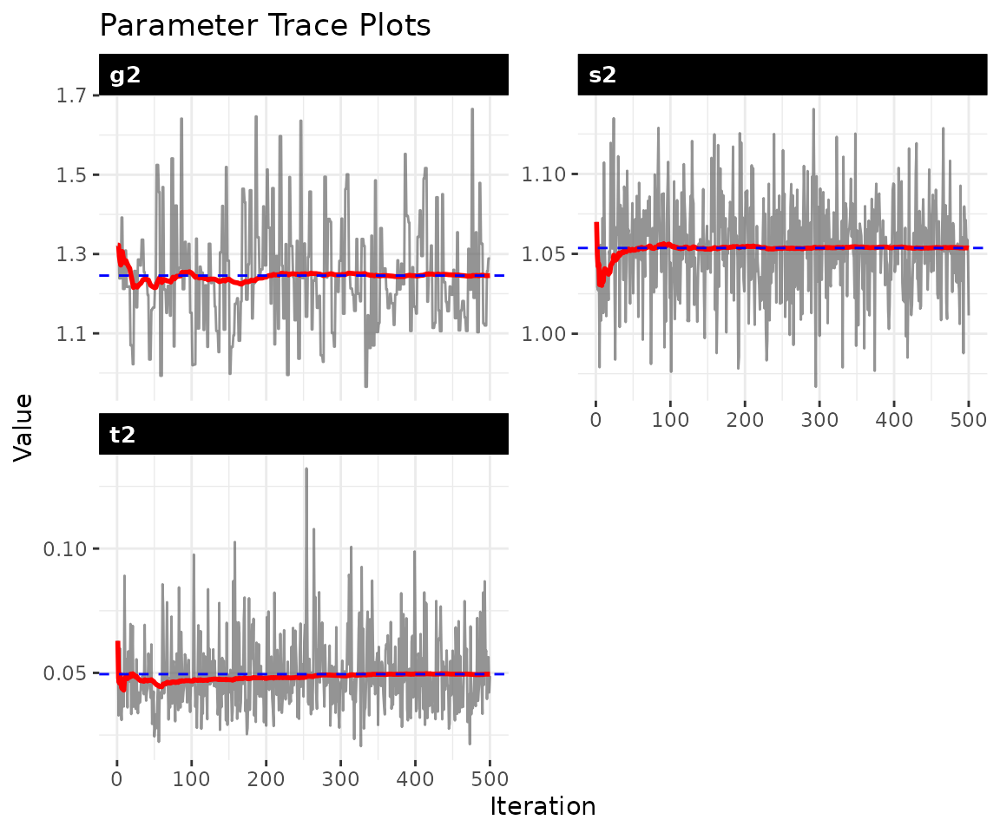
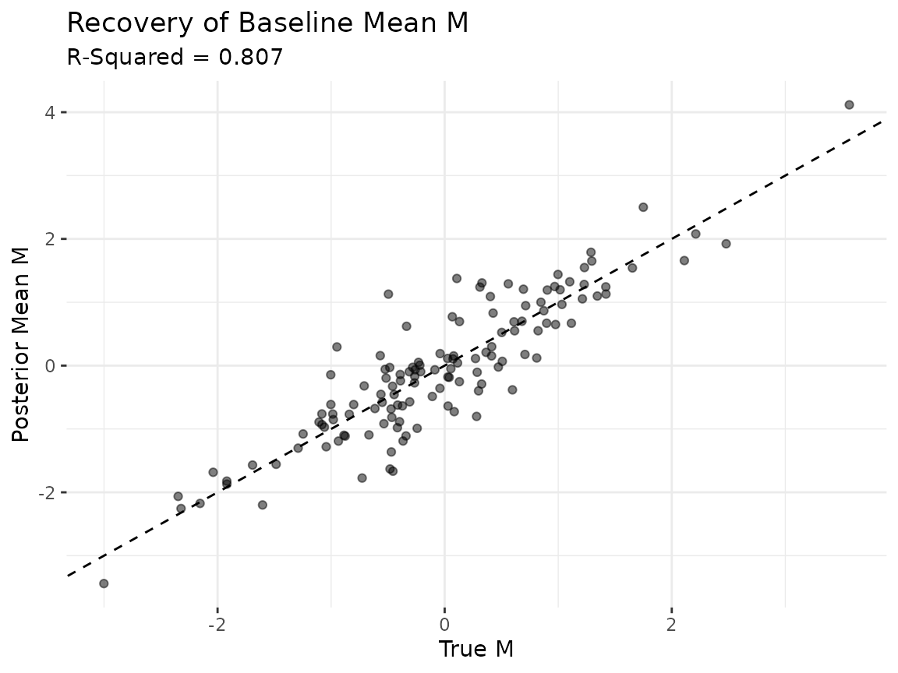
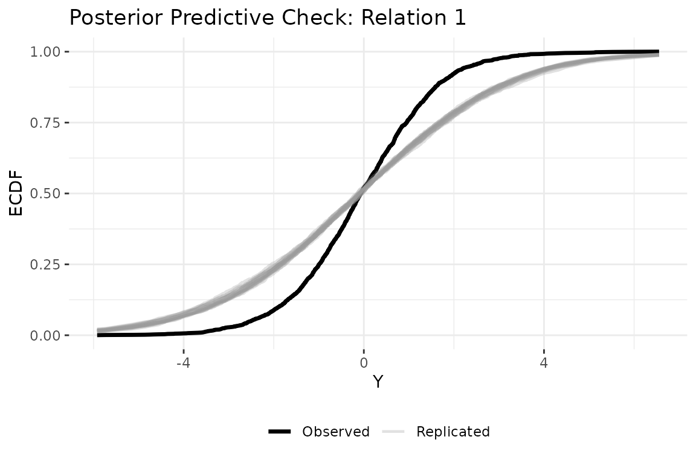

# Getting started: static bilinear network model

## 1 Overview

Dynamic bilinear network (DBN) models estimate how past network
interactions predict future interactions. The package takes as input a
time series of networks stored as a 4D array with dimensions
`[senders, receivers, relation_types, time_points]`, where diagonal
entries (self-ties) are set to `NA`.

The static model is the simplest variant. It estimates time-invariant
sender and receiver influence matrices $A$ and $B$ that govern how the
latent network state evolves:

$$\Theta_{t} = A\,\Theta_{t - 1}\, B^{\top} + M + \varepsilon_{t}$$

The parameter $A$ captures sender influence: entry $a_{i,i\prime}$
measures how strongly actor $i\prime$’s past sending behavior predicts
actor $i$’s current sending. $B$ captures the analogous pattern on the
receiving side. $M$ absorbs persistent dyad-specific tendencies such as
stable rivalries or alliances. Because $A$ and $B$ are constant across
time, the rules governing network evolution do not change; only the
network state $\Theta_{t}$ itself moves.

## 2 Simulate data

We simulate a small network so we have known ground truth to compare
against. The simulation generates both ordinal data (`sim$Y`, integers 1
through 5) and continuous latent values (`sim$Z`). We use `sim$Z` here
because the Gaussian family expects continuous input.

``` r
sim = simulate_static_dbn(
  n      = 12,   # 12 actors
  p      = 1,    # 1 relation type
  time   = 15,   # 15 time periods
  sigma2 = 0.5,  # process noise variance
  tau2   = 0.1,  # prior variance for A and B
  seed   = 6886
)

Y = sim$Z
dim(Y)
#> [1] 12 12  1 15
```

The output confirms the expected `[12, 12, 1, 15]` array structure. The
simulation also returns the true $A$, $B$, $M$, and $\Theta$ matrices,
which we use below to verify that the model recovers the data-generating
process.

## 3 Fit the model

We pass the data array to
[`dbn()`](https://netify-dev.github.io/dbn/reference/dbn.md) and specify
the model type and outcome family. Three MCMC settings control sampling:
`nscan` sets the number of posterior samples to draw after burn-in,
`burn` sets the warm-up period to discard, and `odens` thins the chain
by saving every $k$-th sample to reduce autocorrelation.

``` r
fit = dbn(
  Y,
  model   = "static",
  family  = "gaussian",
  nscan   = 1000,
  burn    = 500,
  odens   = 2,
  verbose = FALSE
)
```

## 4 Convergence diagnostics

MCMC methods produce samples from the posterior distribution, but those
samples are only useful if the chain has converged, meaning it has found
and is exploring the right region of parameter space. Well-behaved trace
plots show stationary fluctuation around a stable mean. Drift, the chain
getting stuck, or slow oscillation are all signs that the chain needs to
run longer.

``` r
check_convergence(fit)
#>       s2       t2       g2 
#> 500.0000 500.0000 191.0568
#> 
#> Fraction in 1st window = 0.1
#> Fraction in 2nd window = 0.5 
#> 
#>      s2      t2      g2 
#> -0.3418 -2.5044 -0.8818
plot_trace(fit)
```



The diagnostics report effective sample size (ESS) and Geweke
statistics. ESS values of at least a few hundred indicate adequate
mixing. The three parameters shown are $\sigma^{2}$ (process variance),
$\tau^{2}$ (A/B prior variance), and $g^{2}$ (latent variance). If any
trace shows trending or poor mixing, increase both `burn` and `nscan`
before proceeding.

## 5 Parameter recovery

A key advantage of simulation studies is that we can check whether the
model recovers the known truth. The scalar variance parameters can
differ in scale between the simulation and the model’s internal
parameterization, so the most informative check is whether the model
recovers the latent baseline structure $M$.

### Scalar parameters

``` r
param_summary(fit)
#>   parameter       mean         sd       q2.5        q50      q97.5
#> 1        s2 1.05365418 0.03099135 0.98926137 1.05537207 1.11870438
#> 2        t2 0.04948152 0.01520899 0.02792947 0.04645109 0.08586179
#> 3        g2 1.24575551 0.14125450 1.02045664 1.22719169 1.54715358
```

### Baseline mean M

The posterior mean of $M$ should correlate with the true $M$ from the
simulation. We exclude diagonal entries (self-ties are `NA` by
construction) and compare all off-diagonal elements.

``` r
M_est = latent_summary(fit, fun = mean)

# exclude diagonal entries from both truth and estimate
n_act = 12
off_diag = which(M_est$i != M_est$j)
est_M_vec = M_est$value[off_diag]

true_M_mat = sim$M[, , 1]
diag(true_M_mat) = NA
true_M_vec = as.vector(true_M_mat)
true_M_vec = true_M_vec[!is.na(true_M_vec)]

df_M = data.frame(truth = true_M_vec, estimate = est_M_vec)
r_sq = round(cor(df_M$truth, df_M$estimate)^2, 3)

ggplot(df_M, aes(x = truth, y = estimate)) +
  geom_abline(slope = 1, intercept = 0, linetype = "dashed") +
  geom_point(alpha = 0.5) +
  labs(
    title = "Recovery of Baseline Mean M",
    subtitle = paste0("R-Squared = ", r_sq),
    x = "True M", y = "Posterior Mean M"
  ) +
  theme_bw() +
  theme(panel.border = element_blank())
```



Points clustering along the 45-degree line indicate that the model is
recovering the true baseline relational tendencies. An $R^{2}$ above 0.8
suggests the posterior mean of $M$ captures most of the cross-sectional
structure in the data-generating process.

## 6 Model summary

The [`summary()`](https://rdrr.io/r/base/summary.html) method reports
posterior means and credible intervals for the scalar parameters, along
with data dimensions, MCMC settings, and the outcome family.

``` r
summary(fit)
```

## 7 Posterior predictive check

A posterior predictive check asks whether data simulated from the fitted
model look like the observed data. We generate replicated datasets from
the posterior, then compare their empirical CDF to the observed data.
Replicated curves that closely track the observed curve indicate the
model captures the data’s distributional features.

``` r
ppd = posterior_predict_dbn(fit, ndraws = 20, seed = 6886)
plot_ppc_ecdf(fit, ppd, Y_obs = Y, rel = 1)
```



## 8 Other outcome families

The static model supports two additional families beyond Gaussian. The
ordinal family uses a rank likelihood that respects the ordering of
categorical data (event counts, Likert items) without assuming a
specific scale. The binary family uses a probit link for 0/1 tie data.

``` r
# ordinal: for ranked data (e.g., event counts, Likert items)
fit_ord = dbn(sim$Y, model = "static", family = "ordinal",
              nscan = 1000, burn = 500, odens = 2, verbose = FALSE)
summary(fit_ord)

# binary: for 0/1 tie presence/absence
Y_binary = array(as.integer(sim$Y[, , , ] > 3), dim = dim(sim$Y))
for (t in seq_len(dim(Y_binary)[4])) diag(Y_binary[, , 1, t]) = NA
fit_bin = dbn(Y_binary, model = "static", family = "binary",
              nscan = 1000, burn = 500, odens = 2, verbose = FALSE)
summary(fit_bin)
```

## 9 Next steps

The static model assumes the influence structure is constant. For
applications where those rules may change, the dynamic model allows
$A_{t}$ and $B_{t}$ to evolve over time (see
[`vignette("dynamic_dbn")`](https://netify-dev.github.io/dbn/articles/dynamic_dbn.md)).
When discrete structural breaks are known in advance, the piecewise
model estimates separate influence matrices for each regime (see
[`vignette("piecewise_dbn")`](https://netify-dev.github.io/dbn/articles/piecewise_dbn.md)).
For the full mathematical framework, see
[`vignette("methodology")`](https://netify-dev.github.io/dbn/articles/methodology.md).
