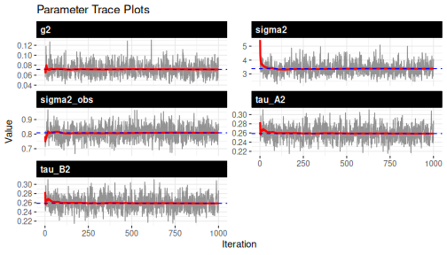
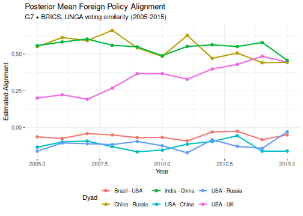
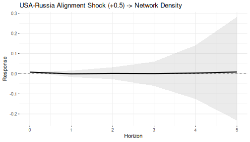
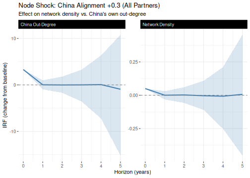
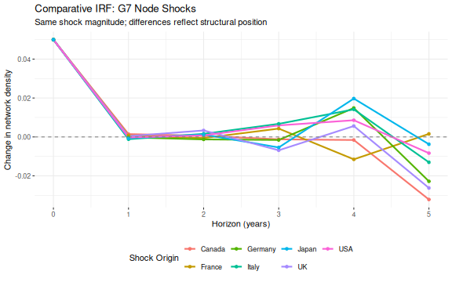
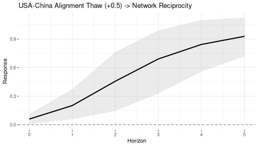

## 1 Overview

This vignette walks through a complete `dbn` workflow on real data --- fitting a dynamic model to foreign policy alignment among 12 major powers (G7 + BRICS) and using impulse response functions (IRFs) to study how shocks propagate through the network.

We use UNGA voting similarity scores from the `peacesciencer` package. The DBN model captures both the time-varying latent structure of the alignment network and the transition dynamics that govern how it evolves. IRFs then let us ask counterfactual questions --- like "what happens to the broader network if USA-Russia alignment suddenly improves?" --- that standard dyadic approaches can't address.

The results here are for methodological demonstration; substantive conclusions would require longer MCMC runs, model comparison, and domain-specific validation.

## 2 Data preparation

We use the `kappavv` measure from `peacesciencer::add_fpsim()`, which captures pairwise agreement in UN General Assembly voting. It's continuous and symmetric (`kappavv(i, j) = kappavv(j, i)`), ranging from -1 (systematic disagreement) to +1 (perfect agreement). Because it's continuous, we use the Gaussian family.

Other UNGA similarity indices exist --- including ideal point distances from Bailey, Strezhnev & Voeten (2017) --- and the choice of measure may affect substantive conclusions. But `kappavv` is a good fit for this tutorial because its continuous, bounded range and symmetric structure map directly onto the model's assumptions.


``` r
# G7 + BRICS: 12 actors
actor_codes = c(
  USA = 2, Canada = 20, UK = 200, France = 220, Germany = 255,
  Italy = 325, Japan = 740, Brazil = 140, Russia = 365,
  India = 750, China = 710, SouthAfrica = 560
)
actor_labels = names(actor_codes)
n = length(actor_codes)

# convenience indices for IRF analysis later
usa_idx    = which(actor_labels == "USA")
russia_idx = which(actor_labels == "Russia")
china_idx  = which(actor_labels == "China")

# build dyadic panel 2005-2015 (UNGA similarity available through 2015)
dyads = create_dyadyears(subset_years = 2005:2015) |>
  add_fpsim()

# filter to our actors
dyads_sub = dyads[dyads$ccode1 %in% actor_codes &
                    dyads$ccode2 %in% actor_codes, ]

years = sort(unique(dyads_sub$year))
Tt = length(years)

cat("Actors:", n, "\n")
#> Actors: 12
cat("Time points:", Tt, "(", min(years), "-", max(years), ")\n")
#> Time points: 11 ( 2005 - 2015 )
```

Next, we reshape the dyadic panel into the `[n, n, p, T]` array that `dbn()` expects. Each slice is the full alignment matrix at one time point, with `NA` on the diagonal to exclude self-ties.


``` r
# build mapping from COW code to matrix index
code_to_idx = setNames(seq_along(actor_codes), actor_codes)

# initialize 4D array: [n_row, n_col, p, T]
Y = array(NA_real_, dim = c(n, n, 1, Tt),
           dimnames = list(actor_labels, actor_labels, "unga",
                           as.character(years)))

for (i in seq_len(nrow(dyads_sub))) {
  row_i = code_to_idx[as.character(dyads_sub$ccode1[i])]
  col_j = code_to_idx[as.character(dyads_sub$ccode2[i])]
  t_idx = which(years == dyads_sub$year[i])
  Y[row_i, col_j, 1, t_idx] = dyads_sub$kappavv[i]
}

# set diagonal to NA (no self-ties)
for (t in 1:Tt) diag(Y[, , 1, t]) = NA

cat("Array dimensions:", paste(dim(Y), collapse = " x "), "\n")
#> Array dimensions: 12 x 12 x 1 x 11
cat("Missing rate:", round(100 * mean(is.na(Y)), 1), "%\n")
#> Missing rate: 8.3 %
cat("Value range:", round(range(Y, na.rm = TRUE), 3), "\n")
#> Value range: -0.245 1
```

Here's a snapshot of the 2010 cross-section. Higher values mean more similar UNGA voting; negative values mean systematic disagreement.


``` r
# 2010 alignment snapshot
Y_2010 = Y[, , 1, which(years == 2010)]
round(Y_2010, 2)
#>               USA Canada    UK France Germany Italy Japan Brazil Russia India
#> USA            NA   0.35  0.35   0.30    0.21  0.16  0.17  -0.04  -0.09 -0.11
#> Canada       0.35     NA  0.44   0.50    0.72  0.68  0.61  -0.04   0.07 -0.20
#> UK           0.35   0.44    NA   0.89    0.67  0.59  0.50  -0.04   0.05 -0.13
#> France       0.30   0.50  0.89     NA    0.74  0.70  0.55  -0.04   0.12 -0.05
#> Germany      0.21   0.72  0.67   0.74      NA  0.94  0.80  -0.02   0.17 -0.16
#> Italy        0.16   0.68  0.59   0.70    0.94    NA  0.75  -0.03   0.22 -0.08
#> Japan        0.17   0.61  0.50   0.55    0.80  0.75    NA  -0.06   0.04 -0.07
#> Brazil      -0.04  -0.04 -0.04  -0.04   -0.02 -0.03 -0.06     NA   0.14  0.21
#> Russia      -0.09   0.07  0.05   0.12    0.17  0.22  0.04   0.14     NA  0.19
#> India       -0.11  -0.20 -0.13  -0.05   -0.16 -0.08 -0.07   0.21   0.19    NA
#> China       -0.11  -0.14 -0.12  -0.11   -0.14 -0.15 -0.02   0.29   0.43  0.45
#> SouthAfrica -0.07  -0.07 -0.07  -0.07   -0.06 -0.06 -0.10   0.57   0.32  0.21
#>             China SouthAfrica
#> USA         -0.11       -0.07
#> Canada      -0.14       -0.07
#> UK          -0.12       -0.07
#> France      -0.11       -0.07
#> Germany     -0.14       -0.06
#> Italy       -0.15       -0.06
#> Japan       -0.02       -0.10
#> Brazil       0.29        0.57
#> Russia       0.43        0.32
#> India        0.45        0.21
#> China          NA        0.48
#> SouthAfrica  0.48          NA
```

## 3 Fit the dynamic model

Since `kappavv` is symmetric (`Y[i,j] = Y[j,i]`), we set `symmetric = TRUE` to constrain the sender and receiver transition matrices to equality ($B_t = A_t$). This is the correct specification for undirected data and halves the number of parameters.


``` r
fit = dbn(
  data      = Y,
  model     = "dynamic",
  family    = "gaussian",
  symmetric = TRUE,
  nscan     = 5000,
  burn      = 2000,
  odens     = 5,
  verbose   = FALSE
)

summary(fit)
```

### Convergence check

Always check convergence before interpreting results. Here are the trace plots for the variance parameters.


``` r
plot_trace(fit)
```

<div class="figure" style="text-align: center">

<p class="caption">plot of chunk convergence</p>
</div>

Well-behaved traces show stationary fluctuation around a stable mean, with no drift or stagnation. Notice that under the symmetric constraint, `tau_A2` and `tau_B2` should be identical --- a useful sanity check. If you see trending or poor mixing, increase both `burn` and `nscan` before proceeding.

## 4 Posterior alignment scores

Let's extract the posterior mean alignment scores. The model estimates a time-varying $\Theta_t$ and a static baseline $M$ --- summing them gives smoothed alignment trajectories for each dyad.


``` r
# posterior mean Theta and M
Theta_mean = apply(fit$Theta, 1:4, mean)
M_mean = apply(fit$M, 1:3, mean)

# alignment = E[Theta_t] + E[M] = E[Theta_t + M]  (by linearity)
alignment = array(NA, dim = c(n, n, 1, length(fit$time_kept)))
for (t_idx in seq_along(fit$time_kept)) {
  alignment[, , 1, t_idx] = Theta_mean[, , 1, t_idx] + M_mean[, , 1]
}

# key dyads to track
key_dyads = list(
  "USA - UK"       = c("USA", "UK"),
  "USA - China"    = c("USA", "China"),
  "USA - Russia"   = c("USA", "Russia"),
  "China - Russia" = c("China", "Russia"),
  "India - China"  = c("India", "China"),
  "Brazil - USA"   = c("Brazil", "USA")
)

stored_years = years[fit$time_kept]
df_align = do.call(rbind, lapply(names(key_dyads), function(nm) {
  pair = key_dyads[[nm]]
  i = which(actor_labels == pair[1])
  j = which(actor_labels == pair[2])
  data.frame(dyad = nm, year = stored_years,
             alignment = alignment[i, j, 1, ],
             stringsAsFactors = FALSE)
}))

ggplot(df_align, aes(x = year, y = alignment, colour = dyad)) +
  geom_line(linewidth = 1) +
  geom_point(size = 2) +
  labs(
    title = "Posterior Mean Foreign Policy Alignment",
    subtitle = "G7 + BRICS, UNGA voting similarity (2005-2015)",
    x = "Year", y = "Estimated Alignment", colour = "Dyad"
  ) +
  theme_bw() +
  theme(
    panel.border = element_blank(),
    legend.position = "bottom"
  )
```

<div class="figure" style="text-align: center">

<p class="caption">plot of chunk alignment-timeseries</p>
</div>

The model recovers patterns consistent with well-known geopolitical structures. China-Russia and India-China cluster at high positive alignment, while USA-China and USA-Russia remain persistently negative. The USA-UK dyad is moderately positive, as expected given the transatlantic alliance. These trajectories provide a reasonable foundation for the counterfactual exercises that follow.

## 5 Impulse response: edge shock

How does a bilateral shock propagate through the broader network? The IRF answers this by applying the estimated transition dynamics recursively:

$$\Delta_0 = S, \quad \Delta_h = A_{t_0+h} \, \Delta_{h-1} \, A_{t_0+h}'$$

At each horizon, we evaluate a network statistic on the perturbed versus baseline network. These are counterfactual exercises --- not causal predictions --- that assume the transition dynamics remain invariant to the shock.

Let's simulate a positive shock to USA-Russia alignment and track its effect on network density.


``` r
# symmetric shock: USA-Russia alignment improves by 0.5
# (for context, the data SD is ~0.33, so this is a ~1.5 SD shift)
S_edge = build_shock(m = n, type = "unit_edge",
                      i = usa_idx, j = russia_idx, magnitude = 0.5)
S_edge = S_edge + t(S_edge)  # symmetric (undirected network)

# compute IRF: effect on network density over 5 horizons
# using all available posterior draws for stable credible intervals
irf_density = compute_irf(
  fit,
  shock    = S_edge,
  H        = 5,
  t0       = 3,
  stat_fun = dbn::stat_density
)

print(irf_density)
#> Network Impulse Response Function
#> Model: dynamic 
#> Statistic: custom_function 
#> Shock time: 3 
#> 
#> Summary:
#>   horizon   mean median    sd   q025  q975    q10   q90
#> 1       0  0.008  0.008 0.000  0.008 0.008  0.008 0.008
#> 2       1 -0.001  0.000 0.015 -0.034 0.028 -0.017 0.015
#> 3       2  0.001  0.001 0.029 -0.058 0.062 -0.028 0.032
#> 4       3  0.000  0.000 0.064 -0.146 0.135 -0.061 0.060
#> 5       4  0.003  0.000 0.219 -0.386 0.322 -0.126 0.141
#> 6       5  0.008  0.002 0.395 -0.608 0.588 -0.232 0.282
```


``` r
plot(irf_density, ci_level = 0.90,
     title = "USA-Russia Alignment Shock (+0.5) -> Network Density")
```

<div class="figure" style="text-align: center">

<p class="caption">plot of chunk plot-irf-edge</p>
</div>

At horizon 0, the shock adds 0.5 to two off-diagonal cells in a 12-actor network, producing a density increase of $2 \times 0.5 / 132 \approx 0.0076$. This initial effect is exact because density is a linear statistic. At subsequent horizons, the credible intervals widen --- reflecting posterior uncertainty in the transition matrices. The rate of decay tells you about the spectral properties of $A$: eigenvalues near unity sustain perturbations, while values well below unity produce rapid decay.

## 6 Impulse response: node shock

What if a country shifts its alignment toward all partners at once? Here we shock China's engagement with every other actor by +0.3 and track two statistics: overall network density and China's own out-degree.


``` r
S_node = build_shock(m = n, type = "node_out",
                      i = china_idx, magnitude = 0.3)
diag(S_node) = 0       # remove self-loop
S_node = S_node + t(S_node)  # symmetrize for undirected network

# effect on network density
irf_china_dens = compute_irf(
  fit, shock = S_node, H = 5, t0 = 3,
  stat_fun = dbn::stat_density
)

# effect on China's out-degree (sum of its alignment scores)
irf_china_outdeg = compute_irf(
  fit, shock = S_node, H = 5, t0 = 3,
  stat_fun = function(X) dbn::stat_out_degree(X)[china_idx]
)
```


``` r
df_irfs = rbind(
  data.frame(irf_china_dens, stat = "Network Density"),
  data.frame(irf_china_outdeg, stat = "China Out-Degree")
)

ggplot(df_irfs, aes(x = horizon, y = mean)) +
  geom_ribbon(aes(ymin = q10, ymax = q90), alpha = 0.2,
              fill = "steelblue") +
  geom_line(colour = "steelblue", linewidth = 1) +
  geom_hline(yintercept = 0, linetype = "dashed", colour = "grey50") +
  facet_wrap(~ stat, scales = "free_y") +
  labs(
    title = "Node Shock: China Alignment +0.3 (All Partners)",
    subtitle = "Effect on network density vs. China's own out-degree",
    x = "Horizon (years)", y = "IRF (change from baseline)"
  ) +
  theme_bw() +
  theme(
    panel.border = element_blank(),
    strip.background = element_rect(fill = "black", color = "black"),
    strip.text.x = element_text(color = "white", hjust = 0)
  )
```

<div class="figure" style="text-align: center">

<p class="caption">plot of chunk plot-irf-node</p>
</div>

At horizon 0, the symmetrized shock adds 0.3 to all 22 of China's ties, increasing density by $22 \times 0.3 / 132 = 0.05$ and China's out-degree by $11 \times 0.3 = 3.3$. Notice the different y-axis scales --- the node-level statistic registers a much larger absolute change. As the shock propagates, the two trajectories need not decay at the same rate, since the transition dynamics can redistribute alignment in ways that differentially affect global versus local statistics.

## 7 Impulse response: comparing shock origins

Which country's engagement shift produces the largest ripple effect? Here we compute the density IRF for an identical outward shock from each G7 member. Since all shocks have the same magnitude, any differences at horizons 1+ reflect each country's structural position in the estimated dynamics.


``` r
g7 = c("USA", "Canada", "UK", "France", "Germany", "Italy", "Japan")

irf_list = lapply(setNames(g7, g7), function(country) {
  idx = which(actor_labels == country)
  S = build_shock(m = n, type = "node_out", i = idx, magnitude = 0.3)
  diag(S) = 0
  S = S + t(S)  # symmetrize
  compute_irf(
    fit, shock = S, H = 5, t0 = 3,
    stat_fun = dbn::stat_density
  )
})
```


``` r
df_compare = do.call(rbind, lapply(names(irf_list), function(nm) {
  d = irf_list[[nm]]
  data.frame(horizon = d$horizon, mean = d$mean,
             q10 = d$q10, q90 = d$q90,
             country = nm, stringsAsFactors = FALSE)
}))

ggplot(df_compare, aes(x = horizon, y = mean, colour = country)) +
  geom_line(linewidth = 1) +
  geom_point(size = 1.5) +
  geom_hline(yintercept = 0, linetype = "dashed", colour = "grey50") +
  labs(
    title = "Comparative IRF: G7 Node Shocks",
    subtitle = "Same shock magnitude; differences reflect structural position",
    x = "Horizon (years)", y = "Change in network density",
    colour = "Shock Origin"
  ) +
  theme_bw() +
  theme(
    panel.border = element_blank(),
    legend.position = "bottom"
  )
```

<div class="figure" style="text-align: center">

<p class="caption">plot of chunk plot-irf-compare</p>
</div>

All countries produce the same effect at horizon 0, as expected. Differences emerge at subsequent horizons as each perturbation propagates differently through the estimated $A_t$ dynamics. That said, the posterior uncertainty (omitted for visual clarity) is large relative to the between-country differences --- so the ranking isn't statistically distinguishable with this chain length. Think of this as illustrating the method's capacity rather than as definitive influence estimates.

## 8 Reciprocity analysis

So far we've used linear statistics (density, degree). Let's try a nonlinear one --- network reciprocity. This matters because nonlinear statistics interact with the baseline network, introducing posterior uncertainty even at horizon 0. Here we simulate a USA-China thaw (+0.5) and track reciprocity.


``` r
S_usachn = build_shock(m = n, type = "unit_edge",
                        i = usa_idx, j = china_idx, magnitude = 0.5)
S_usachn = S_usachn + t(S_usachn)  # symmetric shock

irf_recip = compute_irf(
  fit,
  shock    = S_usachn,
  H        = 5,
  t0       = 3,
  stat_fun = dbn::stat_reciprocity
)
```


``` r
plot(irf_recip, ci_level = 0.90,
     title = "USA-China Alignment Thaw (+0.5) -> Network Reciprocity")
```

<div class="figure" style="text-align: center">

<p class="caption">plot of chunk plot-irf-recip</p>
</div>

Notice the positive bump at horizon 0 --- adding a mutually positive tie mechanically increases network reciprocity. Unlike the density IRF, there's posterior uncertainty even at horizon 0 because reciprocity depends on the full baseline network, which varies across draws. The effect decays quickly, with credible intervals covering zero by horizon 1. A single bilateral thaw increases reciprocity at impact but doesn't sustain it through the estimated dynamics.

## 9 Practical guidance

### Choosing model settings for real data

The settings in this vignette (`nscan = 5000`, `burn = 2000`) are moderate and intended for reasonable build times. For publication-quality results, increase the chain length substantially. Always verify convergence with `plot_trace(fit)` before interpreting results.

```r
fit = dbn(Y, model = "dynamic", family = "gaussian",
           symmetric = TRUE, nscan = 10000, burn = 5000, odens = 5)
```

### Node count limitations

The dynamic model scales as $O(T \times n^3)$ per iteration. Here are rough run-time expectations on an 8-core machine. For 50+ actors, use the low-rank approximation instead.

| Actors | Time points | Approx. time (8 cores) |
|--------|-------------|------------------------|
| 10-15  | 10-20       | 5-15 minutes           |
| 15-25  | 10-20       | 15-60 minutes          |
| 25-50  | 10-20       | 1-4 hours              |
| 50+    | any         | Use `model = "lowrank"` |

```r
fit_lr = dbn(Y, model = "lowrank", r = ceiling(log2(n)),
              nscan = 10000, burn = 5000)
```

### Diagnosing performance bottlenecks

Set `verbose = 200L` to get a per-block timing breakdown at each reported iteration --- useful for identifying bottlenecks in large models.

```r
fit = dbn(Y, model = "dynamic", family = "gaussian",
           nscan = 100, burn = 10, verbose = 200L)
```

### Interpreting IRFs

Key things to keep in mind when reading IRF output:

- **Horizon 0** is the immediate, mechanical consequence of the shock.
- **Linear statistics** (density, degree): no posterior uncertainty at horizon 0, because the shock is a fixed constant.
- **Nonlinear statistics** (reciprocity, transitivity): uncertainty even at horizon 0, because the statistic interacts with the baseline network, which varies across posterior draws.
- **Horizons 1+**: the bilinear dynamics ($A_t$, $B_t$) propagate the shock forward. Uncertainty widens because the transition matrices are themselves estimated with posterior noise.
- **Decay rate**: governed by the spectral radius of $A$ --- eigenvalues near unity sustain the perturbation, values well below unity produce rapid decay.
- **Credible intervals** reflect posterior uncertainty in model parameters, not sampling variability in the observed data.
- **IRFs are counterfactual scenarios** that assume the transition dynamics remain invariant to the shock.

### Symmetric networks

When your data are undirected (`Y[i,j] = Y[j,i]`), make two choices consistently:

- Set `symmetric = TRUE` in `dbn()` to constrain $B_t = A_t$.
- Symmetrize any shock matrix via `S = S + t(S)` after calling `build_shock()`, so both directions of a tie receive equal perturbation.

### Using `time_kept` for time-thinned models

When `time_thin > 1`, the stored $\Theta$ and $A$/$B$ arrays correspond to a subset of the full time series. The `time_kept` element records which original time indices were retained, so you can map stored indices back to substantive time points.

```r
original_years = years[fit$time_kept]
```
